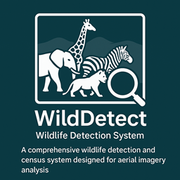

# WildDetect

WildDetect is a powerful wildlife detection and census system for aerial imagery. It helps conservationists, researchers, and organizations analyze wildlife populations, generate geographic visualizations, and produce actionable reports—all with easy-to-use command-line tools.

## Features
- **Multi-species detection** (YOLO-based, optimized for aerial images)
- **Batch processing** of large image datasets
- **Geographic analysis**: GPS mapping, coverage, and flight path analysis
- **Population statistics**: species counts, density, and trends
- **Interactive maps** and visualizations
- **Comprehensive reporting** (JSON, CSV)

## Installation
```bash
# Clone the repository
git clone https://github.com/your-org/wildetect.git
cd wildetect

# Install dependencies
uv sync
```

## Quick Start
Detect wildlife in images:
```bash
wildetect detect /path/to/images --model model.pt --output results/
```
Run a census campaign:
```bash
wildetect census campaign_2024 /path/to/images --model model.pt --output campaign_results/
```

## Main CLI Commands
- `detect` – Run wildlife detection on images
- `census` – Orchestrate a full wildlife census campaign
- `analyze` – Post-process and analyze detection results
- `visualize` – Create interactive geographic visualizations
- `info` – Show system and environment info

For all options, run:
```bash
wildetect --help
```

## 🐾 WildDetect Command-Line Interface (CLI)

WildDetect provides a powerful and flexible command-line interface (CLI) built with [Typer](https://typer.tiangolo.com/), making it easy to run wildlife detection, census campaigns, analysis, visualization, and more—all from your terminal.

### How to Use

After installing WildDetect, simply run:

```bash
wildetect [COMMAND] [OPTIONS]
```

You can always see all available commands and options with:

```bash
wildetect --help
```

### Main Commands

- **detect**  
  Run wildlife detection on images or directories of images.
  ```bash
  wildetect detect /path/to/images --model model.pt --output results/
  ```
  Options include model type, confidence threshold, device (CPU/GPU), batch size, tiling, and more.

- **census**  
  Orchestrate a full wildlife census campaign, including detection, statistics, and reporting.
  ```bash
  wildetect census campaign_2024 /path/to/images --model model.pt --output campaign_results/
  ```
  Supports campaign metadata, pilot info, target species, and advanced analysis.

- **analyze**  
  Analyze detection results for statistics and insights.
  ```bash
  wildetect analyze results.json --output analysis/
  ```

- **visualize**  
  Create interactive geographic maps and visualizations from detection results.
  ```bash
  wildetect visualize results.json --output maps/
  ```

- **info**  
  Display system and environment information, including dependencies and hardware support.
  ```bash
  wildetect info
  ```

- **ui**  
  Launch the WildDetect web interface (Streamlit-based) for interactive exploration.
  ```bash
  wildetect ui
  ```

- **fiftyone**  
  Manage [FiftyOne](https://voxel51.com/docs/fiftyone/) datasets: launch the app, get info, or export data.
  ```bash
  wildetect fiftyone --action launch
  wildetect fiftyone --action info --dataset my_dataset
  wildetect fiftyone --action export --format coco --output export_dir/
  ```

- **clear-results**  
  Delete all detection results in a specified directory (with confirmation).

### General CLI Features

- **Rich Output**: Uses [rich](https://rich.readthedocs.io/) for beautiful tables, progress bars, and colored logs.
- **Flexible Input**: Accepts both individual image files and directories.
- **Advanced Options**: Fine-tune detection, tiling, device selection, and more.
- **Batch Processing**: Efficiently processes large datasets.
- **Integration**: Seamless export to FiftyOne, JSON, and CSV formats.
- **Help for Every Command**: Use `wildetect [COMMAND] --help` for detailed options.

## Configuration
Edit YAML files in `config/` to adjust model, detection, or system settings. See example configs for details.

## Contributing
Contributions are welcome! Please fork the repo, create a feature branch, and submit a pull request. See the full README for details.

## License
MIT License. See [LICENSE](LICENSE) for details. 