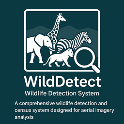
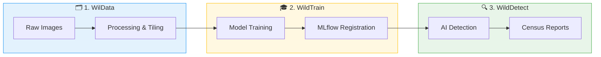

# 🚀 WildDetect: AI for Wildlife Conservation

<div align="center">
  
  <br/>
  <h3>Transforming Aerial Imagery into Actionable Conservation Intelligence</h3>
</div>

---

## The Mission

WildDetect is a comprehensive **AI-driven ecosystem** designed to solve one of the most critical challenges in modern conservation: **scalable and accurate wildlife monitoring.**

By automating the transition from raw aerial imagery to detailed census reports, WildDetect empowers researchers and conservationists to focus on protection and policy, rather than manual image scanning.

---

## 🏗️ An Integrated Ecosystem

WildDetect is built on a modular three-tier architecture that mirrors the natural workflow of a data-driven conservation project:

### 1. The Foundation: **WilData**
Ensure your data is high-quality, version-controlled, and ready for intelligence. WilData handles multi-format imports (COCO, YOLO, Label Studio), geospatial metadata extraction, and large-scale image tiling.

### 2. The Intelligence: **WildTrain**
Transform raw observations into specialized AI models. WildTrain provides a flexible framework for training state-of-the-art YOLO detectors and deep-learning classifiers, integrated with MLflow for complete experiment traceability.

### 3. The Impact: **WildDetect**
Deploy your models in the field. WildDetect orchestrates final "census campaigns," processing thousands of images to generate statistically sound population counts, density maps, and professional PDF reports.

---

## 🗺️ How it Works: The End-to-End Workflow

WildDetect provides a seamless pipeline from raw data to field impact. 

> [!TIP]
> **New to the project?** Explore the [Interactive Script Navigator](docs/script-navigator.md) in our documentation to visually map scripts and CLI commands to each step.


```mermaid
graph LR
    subgraph Foundation ["🗂️ 1. WilData"]
        A["Raw Images"] --> B["Processing & Tiling"]
    end
    subgraph Intelligence ["🎓 2. WildTrain"]
        B --> C["Model Training"]
        C --> D["MLflow Registration"]
    end
    subgraph Impact ["🔍 3. WildDetect"]
        D --> E["AI Detection"]
        E --> F["Census Reports"]
    end
    
    style Foundation fill:#e3f2fd,stroke:#2196f3
    style Intelligence fill:#fff8e1,stroke:#ffc107
    style Impact fill:#e8f5e9,stroke:#4caf50
```

---

## 🚀 Quick Start

### 1. Installation

```bash
# Clone the repository
git clone https://github.com/fadelmamar/wildetect.git
cd wildetect

# Create virtual environment (using uv)
uv venv --python 3.11
.venv\Scripts\activate  # Windows

# Install all packages
cd wildata && uv pip install -e . && cd ..
cd wildtrain && uv pip install -e . && cd ..
uv pip install -e .
```

### 2. Run Your First Detection

```bash
# Run detection using a YAML config
wildetect detection detect -c config/detection.yaml

# Run a complete census campaign
wildetect detection census -c config/census.yaml
```

---

## 📚 Documentation Reference

- **[Full Documentation Home](docs/index.md)**
- **[Interactive Script Navigator](docs/script-navigator.md)**
- **[Installation Guide](docs/getting-started/installation.md)**
- **[Model Training Tutorial](docs/tutorials/model-training.md)**
- **[End-to-End Workflow](docs/tutorials/end-to-end-detection.md)**

---

## 🤝 Community & Support

- **Contribute**: We welcome contributions! From bug reports to code improvements, check out our [GitHub Issues](https://github.com/fadelmamar/wildetect/issues) to see what we're working on.
- **Feedback**: Share your conservation use cases or model results on the [GitHub Discussions](https://github.com/fadelmamar/wildetect/discussions).

---

<div align="center">
  <i>Developed with ❤️ for the conservation community by Seydou Fadel M. and Allin Paul.</i>
</div>