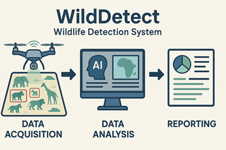

<div align="center">
  
</div>

# WildDetect

WildDetect is a powerful wildlife detection and **census system** for aerial imagery. It helps conservationists, researchers, and organizations analyze wildlife populations, generate **geographic visualizations**, and produce actionable reports—all with easy-to-use command-line tools.

## Features
- **Multi-species detection** (YOLO-based, optimized for aerial images)
- **Batch processing** of large image datasets
- **Geographic analysis**: GPS mapping, coverage, and flight path analysis
- **Population statistics**: species counts, density, and trends
- **Interactive maps** and visualizations
- **Comprehensive reporting** (JSON, CSV)

## Installation
```bash
# Clone the repository
git clone https://github.com/fadelmamar/wildetect.git
cd wildetect

# Install dependencies
uv sync

uv pip install -e .
uv pip install git+https://github.com/FadelMamar/wildtrain
uv pip install git+https://github.com/FadelMamar/wildata
```

## Quick Start
Detect wildlife in images:
```bash
wildetect detect /path/to/images --model model.pt --output results/
```
Run a census campaign:
```bash
wildetect census campaign_2024 /path/to/images --model model.pt --output campaign_results/
```

## Main CLI Commands
- `detect` – Run wildlife detection on images
- `census` – Orchestrate a full wildlife census campaign
- `analyze` – Post-process and analyze detection results
- `visualize` – Create interactive geographic visualizations
- `info` – Show system and environment info
- `api` – Launch FastAPI server for REST API access

For all options, run:
```bash
wildetect --help
```

## 🚀 API Integration

WildDetect now includes a FastAPI backend that exposes all CLI functionalities through REST API endpoints.

### Starting the API Server

```bash
# Start the API server
wildetect api

# Or with custom host/port
wildetect api --host 0.0.0.0 --port 8000

# For development with auto-reload
wildetect api --reload
```

### API Endpoints

The API provides the following endpoints:

- **GET /** - API information and available endpoints
- **GET /info** - System information and dependency status
- **POST /upload** - Upload image files for processing
- **POST /detect** - Start wildlife detection job
- **POST /census** - Start census campaign
- **POST /visualize** - Create visualizations from results
- **POST /analyze** - Analyze detection results
- **GET /jobs/{job_id}** - Monitor background job status
- **GET /fiftyone/launch** - Launch FiftyOne app
- **GET /fiftyone/datasets/{dataset_name}** - Get dataset information
- **POST /fiftyone/export/{dataset_name}** - Export dataset

### API Documentation

Once the server is running, you can access:
- **Swagger UI**: http://localhost:8000/docs
- **ReDoc**: http://localhost:8000/redoc

### Example Usage

```python
import requests

# Check API status
response = requests.get("http://localhost:8000/")
print(response.json())

# Upload images
files = [('files', open('image.jpg', 'rb'))]
response = requests.post("http://localhost:8000/upload", files=files)

# Start detection
detection_request = {
    "confidence": 0.3,
    "device": "auto",
    "batch_size": 16
}
response = requests.post("http://localhost:8000/detect", json=detection_request)
job_id = response.json()["job_id"]

# Monitor job
response = requests.get(f"http://localhost:8000/jobs/{job_id}")
print(response.json())
```

See `examples/api_example.py` for a complete example.

## 🐾 WildDetect Command-Line Interface (CLI)

WildDetect provides a powerful and flexible command-line interface (CLI) built with [Typer](https://typer.tiangolo.com/), making it easy to run wildlife detection, census campaigns, analysis, visualization, and more—all from your terminal.

### How to Use

After installing WildDetect, simply run:

```bash
wildetect [COMMAND] [OPTIONS]
```

You can always see all available commands and options with:

```bash
wildetect --help
```

### Main Commands

- **detect**  
  Run wildlife detection on images or directories of images.
  ```bash
  wildetect detect /path/to/images --model model.pt --output results/
  ```
  Options include model type, confidence threshold, device (CPU/GPU), batch size, tiling, and more.

- **census**  
  Orchestrate a full wildlife census campaign, including detection, statistics, and reporting.
  ```bash
  wildetect census campaign_2024 /path/to/images --model model.pt --output campaign_results/
  ```
  Supports campaign metadata, pilot info, target species, and advanced analysis.

- **analyze**  
  Analyze detection results for statistics and insights.
  ```bash
  wildetect analyze results.json --output analysis/
  ```

- **visualize**  
  Create interactive geographic maps and visualizations from detection results.
  ```bash
  wildetect visualize results.json --output maps/
  ```

- **info**  
  Display system and environment information, including dependencies and hardware support.
  ```bash
  wildetect info
  ```

- **ui**  
  Launch the WildDetect web interface (Streamlit-based) for interactive exploration.
  ```bash
  wildetect ui
  ```

- **fiftyone**  
  Manage [FiftyOne](https://voxel51.com/docs/fiftyone/) datasets: launch the app, get info, or export data.
  ```bash
  wildetect fiftyone --action launch
  wildetect fiftyone --action info --dataset my_dataset
  wildetect fiftyone --action export --format coco --output export_dir/
  ```

- **clear-results**  
  Delete all detection results in a specified directory (with confirmation).

### General CLI Features

- **Rich Output**: Uses [rich](https://rich.readthedocs.io/) for beautiful tables, progress bars, and colored logs.
- **Flexible Input**: Accepts both individual image files and directories.
- **Advanced Options**: Fine-tune detection, tiling, device selection, and more.
- **Batch Processing**: Efficiently processes large datasets.
- **Integration**: Seamless export to FiftyOne, JSON, and CSV formats.
- **Help for Every Command**: Use `wildetect [COMMAND] --help` for detailed options.

## Configuration
Edit YAML files in `config/` to adjust model, detection, or system settings. See example configs for details.

## Contributing
Contributions are welcome! Please fork the repo, create a feature branch, and submit a pull request. See the full README for details.

## License
MIT License. See [LICENSE](LICENSE) for details. 