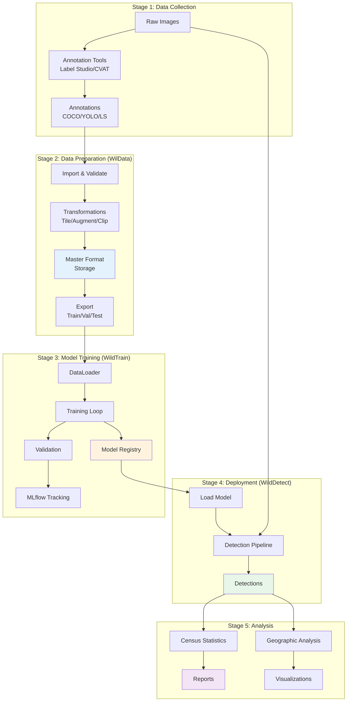
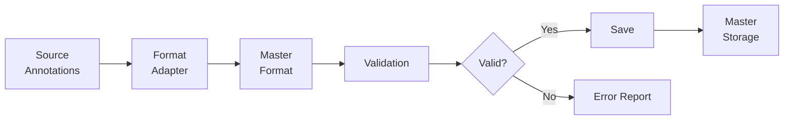
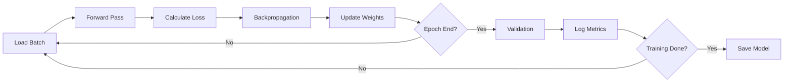
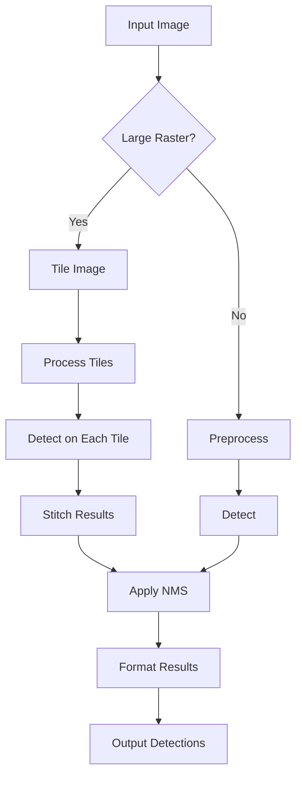
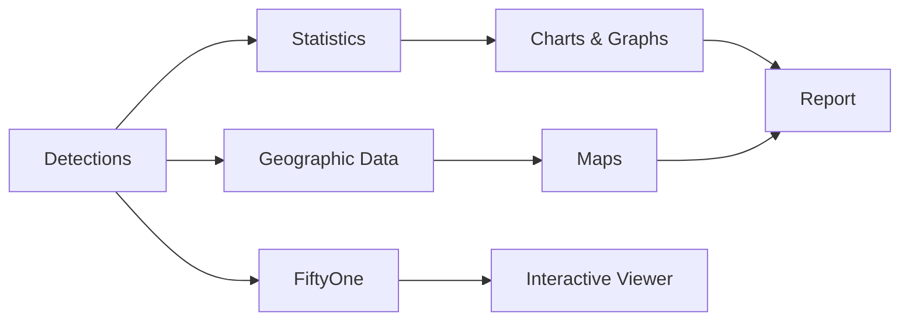
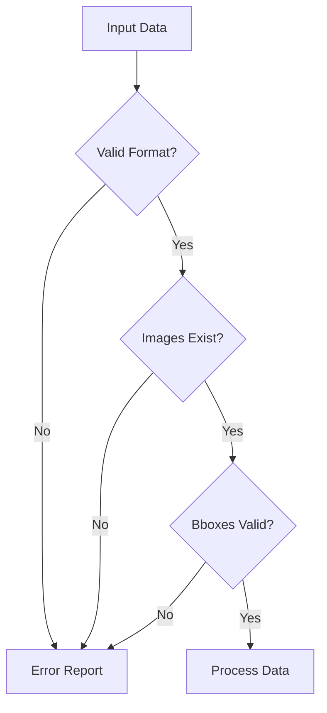

# Data Flow

This document describes how data flows through the WildDetect ecosystem, from raw annotations to final detection results and analysis.

## Complete Pipeline Overview



## Stage 1: Data Collection

### Raw Image Acquisition

Aerial images captured from drones or aircraft:

```
Input: Raw aerial images
Format: JPG, PNG, TIFF, GeoTIFF
Metadata: GPS coordinates (EXIF), flight parameters
Size: Varies (100MB - 10GB per image for rasters)
```

### Annotation Process

Images are annotated using labeling tools:

**Supported Tools**:
- Label Studio (recommended for collaboration)
- CVAT (Computer Vision Annotation Tool)
- Manual COCO/YOLO annotation

**Output Formats**:
- COCO JSON: `annotations.json`
- YOLO: `labels/*.txt` + `data.yaml`
- Label Studio: Export JSON

### Example: Label Studio Workflow

```python
# 1. Setup Label Studio project
# 2. Upload images
# 3. Annotate with bounding boxes
# 4. Export annotations

# Example export structure
{
  "annotations": [
    {
      "id": 1,
      "image": "drone_001.jpg",
      "annotations": [
        {
          "result": [{
            "value": {
              "x": 10, "y": 20, "width": 50, "height": 60,
              "rectanglelabels": ["elephant"]
            }
          }]
        }
      ]
    }
  ]
}
```

## Stage 2: Data Preparation (WilData)

### Import Process



### Format Conversion

All formats converted to unified master format:

```python
# COCO Input
{
  "images": [...],
  "annotations": [...],
  "categories": [...]
}

# ↓ Converted to ↓

# Master Format
{
  "info": {
    "dataset_name": "my_dataset",
    "source_format": "coco",
    "created_at": "2024-01-01T00:00:00"
  },
  "images": [
    {
      "id": 1,
      "file_name": "image.jpg",
      "width": 1920,
      "height": 1080,
      "path": "data/images/train/image.jpg"
    }
  ],
  "annotations": [
    {
      "id": 1,
      "image_id": 1,
      "category_id": 1,
      "bbox": [x, y, width, height],
      "area": 12000,
      "confidence": 1.0
    }
  ],
  "categories": [
    {"id": 1, "name": "elephant"}
  ]
}
```

### Transformation Pipeline

Data transformations applied sequentially:

#### 1. Bbox Clipping

```python
# Before
bbox = [x=-10, y=20, width=100, height=80]  # Outside image bounds

# After clipping
bbox = [x=0, y=20, width=90, height=80]  # Clipped to image
```

#### 2. Tiling

For large images:

```python
# Original: 8000x6000 image with 5 animals
# ↓
# Tiles: 12 tiles of 800x800
# - Tile (0,0): 1 animal
# - Tile (1,0): 2 animals
# - Tile (0,1): 1 animal
# - etc.
```

#### 3. Augmentation

Create variations for training:

```python
# Original image
# ↓
# Augmented versions:
# - Rotated +15°
# - Rotated -15°
# - Brightness adjusted
# - etc.
```

### Export for Training

Convert to framework-specific format:

**YOLO Format**:
```
dataset/
├── images/
│   ├── train/
│   └── val/
├── labels/
│   ├── train/
│   └── val/
└── data.yaml
```

**COCO Format**:
```
dataset/
├── images/
├── train.json
└── val.json
```

## Stage 3: Model Training (WildTrain)

### Data Loading

```python
# DataLoader creates batches
for batch in dataloader:
    images, targets = batch
    # images: tensor [B, 3, H, W]
    # targets: list of dicts with 'boxes', 'labels'
```

### Training Loop



### Model Versioning

```python
# Training produces:
1. Model weights: model.pt
2. Training metrics: logged to MLflow
3. Model artifacts: configs, preprocessing params
4. Model metadata: framework, version, dataset

# Registered to MLflow:
models:/detector_name/version
```

### Data Flow in Training

```python
# Epoch 1:
train_images → model → predictions → loss → optimizer → updated_model
val_images → updated_model → predictions → metrics → log

# Epoch 2:
train_images → updated_model → predictions → loss → optimizer → updated_model
val_images → updated_model → predictions → metrics → log

# ...

# Epoch N:
train_images → final_model → predictions → loss → optimizer → best_model
val_images → best_model → predictions → metrics → save
```

## Stage 4: Deployment (WildDetect)

### Model Loading

```python
# Load from MLflow
model = mlflow.pytorch.load_model("models:/detector/production")

# Or from file
model = torch.load("detector.pt")

# Model ready for inference
```

### Detection Pipeline



### Detection Output Format

```json
{
  "image_path": "drone_001.jpg",
  "image_size": [1920, 1080],
  "processing_time": 0.5,
  "detections": [
    {
      "class_name": "elephant",
      "confidence": 0.95,
      "bbox": [100, 200, 150, 180],
      "bbox_normalized": [0.052, 0.185, 0.078, 0.167]
    },
    {
      "class_name": "giraffe",
      "confidence": 0.89,
      "bbox": [500, 300, 120, 200]
    }
  ],
  "metadata": {
    "model_name": "detector_v1",
    "model_version": "3",
    "timestamp": "2024-01-01T12:00:00"
  }
}
```

### Batch Processing

```python
# Process multiple images
images = ["img1.jpg", "img2.jpg", "img3.jpg"]

# Parallel detection
results = []
for image in images:
    result = pipeline.detect(image)
    results.append(result)

# Save all results
save_results(results, "batch_results.json")
```

## Stage 5: Analysis

### Census Statistics

Aggregate detections across campaign:

```python
# Input: All detection results
total_detections = 1523 animals

# Statistics by species:
{
  "elephant": {
    "count": 423,
    "percentage": 27.8,
    "avg_confidence": 0.93
  },
  "giraffe": {
    "count": 612,
    "percentage": 40.2,
    "avg_confidence": 0.89
  },
  "zebra": {
    "count": 488,
    "percentage": 32.0,
    "avg_confidence": 0.91
  }
}

# Density analysis:
survey_area = 25 km²
density = {
  "elephant": 16.9 per km²,
  "giraffe": 24.5 per km²,
  "zebra": 19.5 per km²
}
```

### Geographic Analysis

```python
# Extract GPS coordinates from images
image_locations = [
  (lat1, lon1),  # Image 1 location
  (lat2, lon2),  # Image 2 location
  ...
]

# Map detections to geographic space
detection_map = {
  (lat1, lon1): ["elephant", "giraffe"],
  (lat2, lon2): ["zebra", "elephant", "elephant"],
  ...
}

# Analyze distribution
hotspots = identify_hotspots(detection_map)
coverage = calculate_coverage(image_locations)
```

### Visualization Pipeline



## Data Storage and Persistence

### Directory Structure

```
project/
├── data/
│   ├── raw/                    # Original images
│   ├── annotations/            # Original annotations
│   └── datasets/               # Processed datasets
│       └── my_dataset/
│           ├── images/
│           │   ├── train/
│           │   └── val/
│           └── annotations/
│               ├── train.json  # Master format
│               └── val.json
├── models/
│   ├── checkpoints/            # Training checkpoints
│   └── trained/                # Final models
├── results/
│   ├── detections/             # Detection outputs
│   ├── census/                 # Census reports
│   └── visualizations/         # Maps, charts
└── mlruns/                     # MLflow tracking data
```

### Data Versioning with DVC

```bash
# Track data with DVC
dvc add data/datasets/my_dataset

# Creates .dvc file
data/datasets/my_dataset.dvc

# Push to remote storage
dvc push

# On another machine
dvc pull
```

## Performance Considerations

### Data Loading Optimization

```python
# Efficient data loading
dataloader = DataLoader(
    dataset,
    batch_size=32,
    num_workers=4,      # Parallel loading (threads on Windows)
    pin_memory=True,    # Faster GPU transfer
    prefetch_factor=2   # Prefetch batches
)
```

### Memory Management

```python
# For large images
with rasterio.open(large_image) as src:
    # Process in windows
    for window in tile_windows:
        tile = src.read(window=window)
        process(tile)
        del tile  # Free memory
```

### Caching

```python
# Cache loaded models
@lru_cache(maxsize=1)
def load_model(model_path):
    return torch.load(model_path)

# Cache detection results
results_cache = {}
if image_hash in results_cache:
    return results_cache[image_hash]
```

## Error Handling and Recovery

### Validation Checkpoints



### Recovery Mechanisms

```python
# Checkpoint-based recovery
for i, image in enumerate(images):
    try:
        result = detect(image)
        save_checkpoint(i, result)
    except Exception as e:
        logger.error(f"Failed on image {i}: {e}")
        if should_continue:
            continue
        else:
            # Resume from last checkpoint
            resume_from_checkpoint(i)
```

## Integration Points

### WilData ↔ WildTrain

```python
# WilData exports dataset
wildata.export_dataset("my_dataset", format="yolo", output="data/yolo")

# WildTrain loads dataset
datamodule = DataModule(data_root="data/yolo")
trainer.fit(model, datamodule)
```

### WildTrain ↔ WildDetect

```python
# WildTrain registers model
mlflow.pytorch.log_model(model, "model")
mlflow.register_model("runs:/.../model", "detector")

# WildDetect loads model
pipeline = DetectionPipeline(mlflow_model_name="detector")
```

### WildDetect ↔ FiftyOne

```python
# WildDetect creates FiftyOne dataset
fo_dataset = create_fiftyone_dataset(detections)

# Launch viewer
session = fo.launch_app(fo_dataset)
```

## Example: Complete Workflow

```python
# 1. Import annotations (WilData)
from wildata import DataPipeline

pipeline = DataPipeline("data")
pipeline.import_dataset(
    source_path="annotations.json",
    source_format="coco",
    dataset_name="training_data",
    transformations={"enable_tiling": True}
)

# 2. Train model (WildTrain)
from wildtrain import Trainer

trainer = Trainer.from_config("configs/yolo.yaml")
model = trainer.train()
model_uri = trainer.register_model("wildlife_detector")

# 3. Run detection (WildDetect)
from wildetect import DetectionPipeline

detector = DetectionPipeline(mlflow_model_uri=model_uri)
results = detector.detect_batch("survey_images/")

# 4. Analyze results (WildDetect)
from wildetect import CensusEngine

census = CensusEngine.from_detections(results)
census.generate_report("census_report.pdf")
```

## Next Steps

- [WilData Architecture →](wildata.md)
- [WildTrain Architecture →](wildtrain.md)
- [WildDetect Architecture →](wildetect.md)
- [End-to-End Tutorial →](../tutorials/end-to-end-detection.md)

