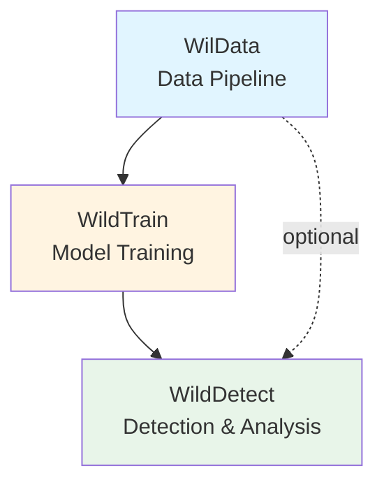
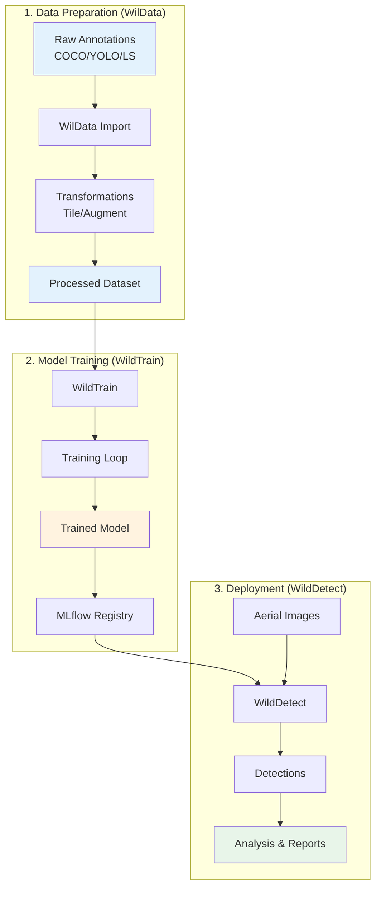

# Architecture Overview

The WildDetect monorepo is designed as a modular ecosystem of three interconnected packages, each serving a specific purpose in the wildlife detection and analysis pipeline.

## Monorepo Structure

```
wildetect/                 # Monorepo root
├── wildata/              # 📦 Data management package
├── wildtrain/            # 🎓 Model training package  
├── src/wildetect/        # 🔍 Detection and analysis package
├── config/               # Shared configurations
├── scripts/              # Batch scripts
├── docs/                 # Documentation
└── mkdocs.yml           # Documentation config
```

## Package Relationships

The three packages have a clear dependency hierarchy:



### Dependency Flow

1. **WilData** (Foundation)
   - Standalone package
   - No dependencies on other packages
   - Provides data management primitives

2. **WildTrain** (Training)
   - Depends on WilData for dataset loading
   - Can be used independently for model training
   - Outputs models for WildDetect

3. **WildDetect** (Application)
   - Depends on WildTrain for model structures
   - Optionally uses WilData for data handling
   - Top-level application package

## Core Principles

### 1. Separation of Concerns

Each package has a single, well-defined responsibility:

- **WilData**: "How do I manage and transform data?"
- **WildTrain**: "How do I train and evaluate models?"
- **WildDetect**: "How do I detect wildlife and analyze results?"

### 2. Modularity

Packages can be used independently:

```python
# Use WilData alone for data management
from wildata import DataPipeline

# Use WildTrain alone for training
from wildtrain import Trainer

# Use WildDetect for detection
from wildetect import DetectionPipeline
```

### 3. Configuration-Driven

All behavior is configurable via YAML files:

```yaml
# Each package has its own configs
wildetect/config/         # Detection configs
wildata/configs/          # Data configs
wildtrain/configs/        # Training configs
```

### 4. Clean Architecture

Each package follows clean architecture principles:

```
src/package/
├── core/          # Business logic (domain)
├── adapters/      # External interfaces
├── cli/           # Command-line interface
├── api/           # REST API (if applicable)
└── ui/            # User interface (if applicable)
```

## Package Overview

### 📦 WilData - Data Management

**Purpose**: Unified data pipeline for object detection datasets

**Key Features**:
- Multi-format import/export (COCO, YOLO, Label Studio)
- Data transformations (tiling, augmentation, clipping)
- ROI dataset creation
- DVC integration for versioning
- REST API for remote operations

**Use Cases**:
- Import annotations from labeling tools
- Prepare datasets for training
- Create ROI datasets for hard sample mining
- Version control large datasets

[Learn more →](wildata.md)

### 🎓 WildTrain - Model Training

**Purpose**: Modular training framework for detection and classification

**Key Features**:
- Multiple frameworks (YOLO, MMDetection, PyTorch Lightning)
- Hydra configuration management
- MLflow experiment tracking
- Hyperparameter optimization (Optuna)
- Model registration and versioning

**Use Cases**:
- Train custom detection models
- Train classification models
- Hyperparameter tuning
- Model evaluation and comparison
- Export models for deployment

[Learn more →](wildtrain.md)

### 🔍 WildDetect - Detection & Analysis

**Purpose**: Production detection system with census capabilities

**Key Features**:
- Multi-threaded detection pipelines
- Large raster image support
- Census campaign orchestration
- Geographic analysis and visualization
- FiftyOne integration
- Comprehensive reporting

**Use Cases**:
- Run detection on aerial imagery
- Conduct wildlife census campaigns
- Generate population statistics
- Create geographic visualizations
- Export results for analysis

[Learn more →](wildetect.md)

## Data Flow

### Complete Workflow



### Example: Complete Pipeline

```python
# 1. WilData: Prepare dataset
from wildata import DataPipeline

pipeline = DataPipeline("data")
pipeline.import_dataset(
    source_path="annotations.json",
    source_format="coco",
    dataset_name="training_data"
)

# 2. WildTrain: Train model
from wildtrain import Trainer

trainer = Trainer(config="configs/yolo.yaml")
model = trainer.train()
model_uri = trainer.register_model("detector_v1")

# 3. WildDetect: Run detection
from wildetect import DetectionPipeline

detector = DetectionPipeline(model_uri=model_uri)
results = detector.detect_batch("aerial_images/")
detector.generate_report(results, "census_report.json")
```

[See detailed data flow →](data-flow.md)

## Technology Stack

### Core Technologies

| Component | Technology | Purpose |
|-----------|-----------|---------|
| **Language** | Python 3.9+ | Primary language |
| **CLI** | Typer | Command-line interfaces |
| **Config** | Hydra/OmegaConf | Configuration management |
| **Detection** | YOLO, MMDetection | Object detection |
| **Training** | PyTorch Lightning | Model training |
| **API** | FastAPI | REST API (WilData) |
| **UI** | Streamlit | Web interfaces |
| **Visualization** | FiftyOne | Dataset visualization |
| **Tracking** | MLflow | Experiment tracking |
| **Versioning** | DVC | Data versioning |

### Key Libraries

#### Data Processing
- **Pillow**: Image processing
- **OpenCV**: Computer vision operations
- **Rasterio**: Geospatial raster data
- **Pandas**: Tabular data manipulation
- **Albumentations**: Data augmentation

#### Machine Learning
- **PyTorch**: Deep learning framework
- **Ultralytics**: YOLO implementation
- **MMDetection**: Detection framework
- **Torchvision**: Vision utilities

#### Utilities
- **Pydantic**: Data validation
- **Rich**: Terminal formatting
- **TQDM**: Progress bars
- **PyYAML**: YAML parsing

## Design Patterns

### 1. Factory Pattern

Used for creating detectors, trainers, and datasets:

```python
# Detector factory
detector = DetectorFactory.create(
    framework="yolo",
    model_path="model.pt"
)

# Dataset factory
dataset = DatasetFactory.create(
    format="coco",
    path="annotations.json"
)
```

### 2. Strategy Pattern

Used for different processing strategies:

```python
# Different detection strategies
pipeline = DetectionPipeline(
    strategy="raster"  # or "simple", "multithreaded", etc.
)
```

### 3. Adapter Pattern

Used for format conversions:

```python
# COCO to YOLO adapter
coco_data = COCODataset(path)
yolo_adapter = YOLOAdapter(coco_data)
yolo_data = yolo_adapter.convert()
```

### 4. Pipeline Pattern

Used for data transformations:

```python
# Transformation pipeline
pipeline = TransformationPipeline([
    BBoxClippingTransform(),
    TilingTransform(tile_size=800),
    AugmentationTransform()
])
transformed = pipeline.apply(dataset)
```

## Configuration Management

### Hierarchical Configuration

Each package uses a hierarchical configuration system:

```yaml
# configs/main.yaml
defaults:
  - model: yolo
  - data: coco
  - training: default

# Override with CLI
python main.py model=custom data.batch_size=64
```

### Configuration Sources

1. **Default configs**: Sensible defaults in code
2. **YAML files**: User configurations
3. **Environment variables**: `.env` files
4. **CLI arguments**: Command-line overrides

Priority: CLI > Env Vars > YAML > Defaults

## Error Handling

### Centralized Error Management

```python
from wildetect.core.exceptions import (
    DetectionError,
    ModelLoadError,
    ConfigurationError
)

try:
    detector.detect(image)
except ModelLoadError as e:
    logger.error(f"Failed to load model: {e}")
except DetectionError as e:
    logger.error(f"Detection failed: {e}")
```

### Validation

All inputs are validated using Pydantic:

```python
from pydantic import BaseModel, validator

class DetectionConfig(BaseModel):
    batch_size: int
    tile_size: int
    
    @validator('batch_size')
    def validate_batch_size(cls, v):
        if v <= 0:
            raise ValueError("batch_size must be positive")
        return v
```

## Logging and Monitoring

### Structured Logging

```python
import logging

logger = logging.getLogger(__name__)
logger.info("Processing image", extra={
    "image_path": path,
    "tile_size": 800,
    "batch_size": 32
})
```

### Experiment Tracking

```python
import mlflow

with mlflow.start_run():
    mlflow.log_params(config)
    mlflow.log_metrics({"accuracy": 0.95})
    mlflow.log_artifact("model.pt")
```

## Testing Strategy

### Test Structure

```
tests/
├── unit/              # Unit tests
│   ├── test_core/
│   └── test_adapters/
├── integration/       # Integration tests
│   └── test_pipelines/
└── e2e/              # End-to-end tests
    └── test_workflows/
```

### Running Tests

```bash
# Run all tests
uv run pytest tests/ -v

# Run specific package tests
uv run pytest tests/test_detection_pipeline.py -v

# With coverage
uv run pytest --cov=wildetect tests/
```

## Performance Considerations

### Optimization Strategies

1. **Multi-threading**: For I/O-bound operations (Windows-compatible)
2. **Batch Processing**: Process multiple images together
3. **Caching**: Cache loaded models and configurations
4. **Memory Management**: Efficient image loading and cleanup
5. **GPU Utilization**: Maximize GPU usage with appropriate batch sizes

### Scalability

- **Horizontal**: Process multiple images in parallel
- **Vertical**: Use larger models and batch sizes
- **Distributed**: Deploy inference servers for remote processing

## Security Considerations

- **API Keys**: Stored in `.env`, never in code
- **File Paths**: Validated before processing
- **Input Validation**: All inputs validated with Pydantic
- **Dependency Management**: Regular security updates

## Next Steps

Explore individual package architectures:

- [WilData Architecture →](wildata.md)
- [WildTrain Architecture →](wildtrain.md)
- [WildDetect Architecture →](wildetect.md)
- [Data Flow Details →](data-flow.md)

Or dive into specific topics:

- [Scripts Reference](../scripts/wildetect/index.md)
- [Configuration Reference](../configs/wildetect/index.md)
- [API Documentation](../api-reference/python-api.md)

