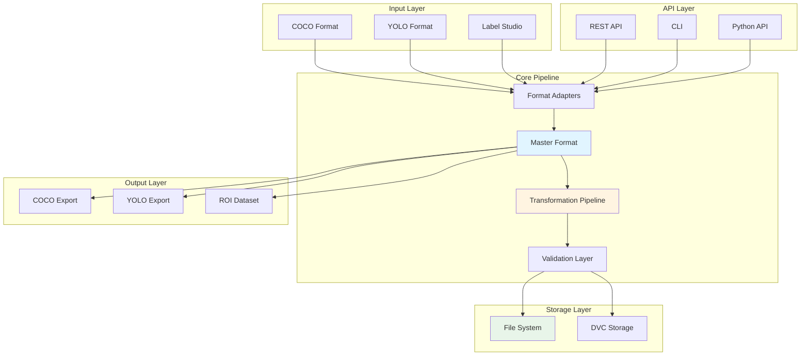

# WilData Architecture

WilData is the data management foundation of the WildDetect ecosystem, providing a unified pipeline for importing, transforming, and exporting object detection datasets.

## Overview

**Purpose**: Unified data pipeline and management system for computer vision datasets

**Key Responsibilities**:
- Multi-format dataset import/export
- Data transformations and augmentation
- ROI dataset creation
- DVC integration for versioning
- REST API for programmatic access

## Architecture Diagram



## Core Components

### 1. Format Adapters

Convert between different annotation formats.

#### COCO Adapter
```python
# src/wildata/adapters/coco_adapter.py
class COCOAdapter:
    """Adapter for COCO format datasets."""
    
    def load(self, path: Path) -> MasterDataset:
        """Load COCO annotations into master format."""
        
    def save(self, dataset: MasterDataset, path: Path):
        """Export master format to COCO."""
```

#### YOLO Adapter
```python
# src/wildata/adapters/yolo_adapter.py
class YOLOAdapter:
    """Adapter for YOLO format datasets."""
    
    def load(self, path: Path) -> MasterDataset:
        """Load YOLO annotations into master format."""
        
    def save(self, dataset: MasterDataset, path: Path):
        """Export master format to YOLO."""
```

#### Label Studio Adapter
```python
# src/wildata/adapters/ls_adapter.py
class LabelStudioAdapter:
    """Adapter for Label Studio export format."""
    
    def load(self, path: Path) -> MasterDataset:
        """Load Label Studio annotations."""
```

### 2. Master Format

Internal unified representation for all datasets.

```python
# src/wildata/core/master_format.py
@dataclass
class MasterDataset:
    """Unified dataset representation."""
    images: List[ImageInfo]
    annotations: List[Annotation]
    categories: List[Category]
    metadata: Dict[str, Any]

@dataclass
class ImageInfo:
    id: int
    file_name: str
    width: int
    height: int
    path: Path
    metadata: Optional[Dict] = None

@dataclass
class Annotation:
    id: int
    image_id: int
    category_id: int
    bbox: List[float]  # [x, y, width, height]
    area: float
    segmentation: Optional[List] = None
```

### 3. Transformation Pipeline

Apply transformations to datasets.

#### Bbox Clipping
```python
# src/wildata/transforms/bbox_clipping.py
class BBoxClippingTransform:
    """Clip bounding boxes to image boundaries."""
    
    def __init__(self, tolerance: int = 5, skip_invalid: bool = False):
        self.tolerance = tolerance
        self.skip_invalid = skip_invalid
    
    def apply(self, dataset: MasterDataset) -> MasterDataset:
        """Apply clipping to all bboxes."""
```

#### Tiling Transform
```python
# src/wildata/transforms/tiling.py
class TilingTransform:
    """Tile large images into smaller patches."""
    
    def __init__(
        self,
        tile_size: int = 512,
        stride: int = 416,
        min_visibility: float = 0.1
    ):
        self.tile_size = tile_size
        self.stride = stride
        self.min_visibility = min_visibility
    
    def apply(self, dataset: MasterDataset) -> MasterDataset:
        """Tile all images in dataset."""
```

#### Augmentation Transform
```python
# src/wildata/transforms/augmentation.py
class AugmentationTransform:
    """Apply data augmentation."""
    
    def __init__(
        self,
        rotation_range: Tuple[float, float] = (-45, 45),
        probability: float = 1.0,
        num_transforms: int = 2
    ):
        self.rotation_range = rotation_range
        self.probability = probability
        self.num_transforms = num_transforms
    
    def apply(self, dataset: MasterDataset) -> MasterDataset:
        """Augment dataset."""
```

### 4. ROI Adapter

Extract regions of interest for classification datasets.

```python
# src/wildata/adapters/roi_adapter.py
class ROIAdapter:
    """Convert detection datasets to ROI classification datasets."""
    
    def __init__(
        self,
        roi_box_size: int = 128,
        min_roi_size: int = 32,
        random_roi_count: int = 10,
        background_class: str = "background"
    ):
        self.roi_box_size = roi_box_size
        self.min_roi_size = min_roi_size
        self.random_roi_count = random_roi_count
        self.background_class = background_class
    
    def convert(self, coco_data: dict) -> ROIDataset:
        """Convert COCO dataset to ROI dataset."""
        # Extract ROIs from bboxes
        # Generate background samples
        # Create classification dataset
```

**Use Cases**:
- Hard sample mining
- Error analysis
- Training ROI-based classifiers
- Creating balanced classification datasets

### 5. Data Pipeline

Main orchestrator for data operations.

```python
# src/wildata/pipeline/data_pipeline.py
class DataPipeline:
    """Main data pipeline orchestrator."""
    
    def __init__(self, root: str = "data", enable_dvc: bool = False):
        self.root = Path(root)
        self.enable_dvc = enable_dvc
        self.dvc_manager = DVCManager() if enable_dvc else None
    
    def import_dataset(
        self,
        source_path: str,
        source_format: str,
        dataset_name: str,
        transformations: Optional[TransformConfig] = None,
        track_with_dvc: bool = False
    ) -> ImportResult:
        """Import dataset with optional transformations."""
        # 1. Load using appropriate adapter
        # 2. Validate data
        # 3. Apply transformations
        # 4. Save to master format
        # 5. Track with DVC if enabled
    
    def export_dataset(
        self,
        dataset_name: str,
        target_format: str,
        output_path: Optional[str] = None
    ) -> ExportResult:
        """Export dataset to target format."""
    
    def list_datasets(self) -> List[DatasetInfo]:
        """List all available datasets."""
    
    def get_dataset_info(self, dataset_name: str) -> DatasetInfo:
        """Get detailed dataset information."""
```

### 6. DVC Manager

Handle data versioning with DVC.

```python
# src/wildata/pipeline/dvc_manager.py
class DVCManager:
    """DVC integration for data versioning."""
    
    def setup(self, storage_type: DVCStorageType, storage_path: str):
        """Initialize DVC remote."""
    
    def track(self, path: Path) -> bool:
        """Add path to DVC tracking."""
    
    def push(self) -> bool:
        """Push data to remote."""
    
    def pull(self, dataset_name: Optional[str] = None) -> bool:
        """Pull data from remote."""
    
    def status(self) -> DVCStatus:
        """Get DVC status."""
```

## REST API

FastAPI-based API for remote operations.

### API Structure

```python
# src/wildata/api/main.py
app = FastAPI(title="WilData API")

# Routers
app.include_router(datasets_router, prefix="/api/v1/datasets")
app.include_router(roi_router, prefix="/api/v1/roi")
app.include_router(gps_router, prefix="/api/v1/gps")
app.include_router(jobs_router, prefix="/api/v1/jobs")
app.include_router(health_router, prefix="/api/v1/health")
```

### Background Jobs

Long-running operations handled asynchronously:

```python
# src/wildata/api/services/job_queue.py
class JobQueue:
    """Background job queue for async operations."""
    
    def submit(self, job_type: str, **kwargs) -> str:
        """Submit job and return job_id."""
    
    def get_status(self, job_id: str) -> JobStatus:
        """Get job status."""
    
    def cancel(self, job_id: str) -> bool:
        """Cancel running job."""
```

## CLI Interface

Command-line interface built with Typer.

```python
# src/wildata/cli/main.py
app = typer.Typer()

@app.command()
def import_dataset(
    source_path: str,
    format: str = typer.Option(..., "--format", "-f"),
    name: str = typer.Option(..., "--name", "-n"),
    config: Optional[str] = typer.Option(None, "--config", "-c")
):
    """Import dataset from source format."""

@app.command()
def export_dataset(
    dataset_name: str,
    format: str,
    output: Optional[str] = None
):
    """Export dataset to target format."""

@app.command()
def create_roi(
    source_path: str,
    config: str = typer.Option(..., "--config", "-c")
):
    """Create ROI dataset."""
```

## Configuration System

### Import Configuration

```yaml
# configs/import-config-example.yaml
source_path: "annotations.json"
source_format: "coco"  # coco, yolo, ls
dataset_name: "my_dataset"

root: "data"
split_name: "train"  # train, val, test
processing_mode: "batch"  # streaming, batch

# Transformations
transformations:
  enable_bbox_clipping: true
  bbox_clipping:
    tolerance: 5
    skip_invalid: false
  
  enable_augmentation: false
  augmentation:
    rotation_range: [-45, 45]
    probability: 1.0
    num_transforms: 2
  
  enable_tiling: true
  tiling:
    tile_size: 800
    stride: 640
    min_visibility: 0.7
    max_negative_tiles_in_negative_image: 2

# ROI Configuration
roi_config:
  random_roi_count: 10
  roi_box_size: 128
  min_roi_size: 32
  background_class: "background"
  save_format: "jpg"
  quality: 95
```

## Data Storage

### Directory Structure

```
data/
├── datasets/
│   ├── dataset_name/
│   │   ├── images/
│   │   │   ├── train/
│   │   │   ├── val/
│   │   │   └── test/
│   │   └── annotations/
│   │       ├── train.json        # Master format
│   │       ├── val.json
│   │       └── test.json
│   └── ...
├── exports/
│   ├── coco/
│   └── yolo/
└── .dvc/                         # DVC metadata
```

### Master Format Storage

Datasets are stored in an extended COCO-like format:

```json
{
  "info": {
    "dataset_name": "my_dataset",
    "created_at": "2024-01-01T00:00:00",
    "source_format": "coco",
    "transformations_applied": ["tiling", "clipping"]
  },
  "images": [...],
  "annotations": [...],
  "categories": [...]
}
```

## Validation

All data is validated at import:

```python
# src/wildata/core/validation.py
class DatasetValidator:
    """Validate dataset integrity."""
    
    def validate_coco(self, data: dict) -> ValidationResult:
        """Validate COCO format."""
        # Check required fields
        # Validate bbox coordinates
        # Check image references
        # Validate category IDs
    
    def validate_yolo(self, data_yaml: Path) -> ValidationResult:
        """Validate YOLO format."""
    
    def validate_master(self, dataset: MasterDataset) -> ValidationResult:
        """Validate master format."""
```

## Performance Optimization

### Streaming Mode

For large datasets:

```python
# Process datasets in streaming mode
pipeline.import_dataset(
    source_path="large_dataset.json",
    source_format="coco",
    dataset_name="large",
    processing_mode="streaming"  # Process in chunks
)
```

### Parallel Processing

Use threading for I/O-bound operations:

```python
from concurrent.futures import ThreadPoolExecutor

with ThreadPoolExecutor(max_workers=4) as executor:
    futures = [
        executor.submit(process_image, img)
        for img in images
    ]
```

## Use Cases

### 1. Import and Transform

```python
from wildata import DataPipeline

pipeline = DataPipeline("data")

# Import with transformations
result = pipeline.import_dataset(
    source_path="annotations.json",
    source_format="coco",
    dataset_name="processed",
    transformations={
        "enable_tiling": True,
        "tiling": {"tile_size": 800, "stride": 640}
    }
)
```

### 2. Create ROI Dataset

```python
from wildata.adapters import ROIAdapter

# Load COCO data
with open("annotations.json") as f:
    coco_data = json.load(f)

# Convert to ROI dataset
roi_adapter = ROIAdapter(
    roi_box_size=128,
    random_roi_count=10
)
roi_dataset = roi_adapter.convert(coco_data)
roi_adapter.save(roi_dataset, output_dir="roi_dataset")
```

### 3. DVC Workflow

```bash
# Setup DVC
wildata dvc setup --storage-type s3 --storage-path s3://bucket/data

# Import with tracking
wildata import-dataset data.json --format coco --name ds --track-dvc

# Push to remote
wildata dvc push

# On another machine
wildata dvc pull ds
```

## Next Steps

- [WildTrain Architecture →](wildtrain.md)
- [WildDetect Architecture →](wildetect.md)
- [Data Flow Details →](data-flow.md)
- [WilData CLI Reference →](../api-reference/wildata-cli.md)
- [WilData Scripts →](../scripts/wildata/index.md)

