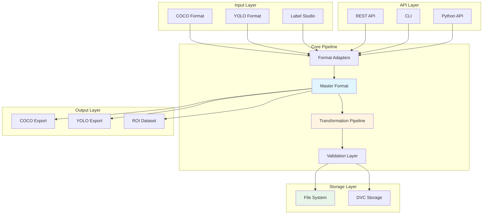

# WilData Architecture

WilData is the data management foundation of the WildDetect ecosystem, providing a unified pipeline for importing, transforming, and exporting object detection datasets.

## Overview

**Purpose**: Unified data pipeline and management system for computer vision datasets

**Key Responsibilities**:
- Multi-format dataset import/export
- Data transformations and augmentation
- ROI dataset creation
- DVC integration for versioning
- REST API for programmatic access

## Architecture Diagram


```mermaid
graph TB
    subgraph "Input Layer"
        A[COCO Format]
        B[YOLO Format]
        C[Label Studio]
    end
    
    subgraph "Core Pipeline"
        D[Format Adapters]
        E[Master Format]
        F[Transformation Pipeline]
        G[Validation Layer]
    end
    
    subgraph "Storage Layer"
        H[File System]
        I[DVC Storage]
    end
    
    subgraph "Output Layer"
        J[COCO Export]
        K[YOLO Export]
        L[ROI Dataset]
    end
    
    subgraph "API Layer"
        M[REST API]
        N[CLI]
        O[Python API]
    end
    
    A --> D
    B --> D
    C --> D
    D --> E
    E --> F
    F --> G
    G --> H
    G --> I
    E --> J
    E --> K
    E --> L
    
    M --> D
    N --> D
    O --> D
    
    style E fill:#e1f5ff
    style F fill:#fff4e1
    style H fill:#e8f5e9
```

## Core Components

#### Dataset Adapters
Adapters provide the logic to convert various annotation formats into the WilData Master Format:
- **COCO Adapter**: Processes COCO JSON annotations.
- **YOLO Adapter**: Processes YOLO TXT annotations and YAML configuration.
- **Label Studio Adapter**: Processes exports from the Label Studio annotation platform.

### 2. Master Format

Internal unified representation for all datasets.

A unified internal representation used to store images, annotations, categories, and metadata consistently across the toolkit.

### 3. Transformation Pipeline

Apply transformations to datasets.

Reusable processing steps applied to datasets during import or export:
- **Bbox Clipping**: Ensures bounding boxes stay within image limits.
- **Tiling**: Splits large images into smaller tiles while preserving and adjusting annotations.
- **Augmentation**: Generates synthetic training data through rotations and flips.

### 4. ROI Adapter

Extract regions of interest for classification datasets.

```python
Specialized tool for extracting sub-images (ROIs) from detection datasets to create classification datasets for species identification.

**Use Cases**:
- Hard sample mining
- Error analysis
- Training ROI-based classifiers
- Creating balanced classification datasets

### 5. Data Pipeline

Main orchestrator for data operations.

```python
The central coordination layer that handles dataset lifecycle: loading, validation, transformation, and storage.

### 6. DVC Manager

Handle data versioning with DVC.

```python
Integrates Data Version Control for tracking large image files and synchronizing them with cloud or remote storage.

## REST API

FastAPI-based API for remote operations.

### API Structure

```python
WilData provides a REST API built with FastAPI that exposes endpoints for dataset management and job status monitoring.

### Background Jobs

Long-running operations handled asynchronously:

```python
Long-running operations (like large transformations) are handled in a background job queue to ensure responsiveness.

## CLI Interface

Command-line interface built with Typer.

```python
All core functionalities are exposed through a comprehensive CLI built with Typer. Detailed command documentation is available in the [CLI Reference](../api-reference/wildata-cli.md).

## Configuration System

### Import Configuration

```yaml
# configs/import-config-example.yaml
source_path: "annotations.json"
source_format: "coco"  # coco, yolo, ls
dataset_name: "my_dataset"

root: "data"
split_name: "train"  # train, val, test
processing_mode: "batch"  # streaming, batch

# Transformations
transformations:
  enable_bbox_clipping: true
  bbox_clipping:
    tolerance: 5
    skip_invalid: false
  
  enable_augmentation: false
  augmentation:
    rotation_range: [-45, 45]
    probability: 1.0
    num_transforms: 2
  
  enable_tiling: true
  tiling:
    tile_size: 800
    stride: 640
    min_visibility: 0.7
    max_negative_tiles_in_negative_image: 2

# ROI Configuration
roi_config:
  random_roi_count: 10
  roi_box_size: 128
  min_roi_size: 32
  background_class: "background"
  save_format: "jpg"
  quality: 95
```

## Data Storage

### Directory Structure

```
data/
├── datasets/
│   ├── dataset_name/
│   │   ├── images/
│   │   │   ├── train/
│   │   │   ├── val/
│   │   │   └── test/
│   │   └── annotations/
│   │       ├── train.json        # Master format
│   │       ├── val.json
│   │       └── test.json
│   └── ...
├── exports/
│   ├── coco/
│   └── yolo/
└── .dvc/                         # DVC metadata
```

### Master Format Storage

Datasets are stored in an extended COCO-like format:

```json
{
  "info": {
    "dataset_name": "my_dataset",
    "created_at": "2024-01-01T00:00:00",
    "source_format": "coco",
    "transformations_applied": ["tiling", "clipping"]
  },
  "images": [...],
  "annotations": [...],
  "categories": [...]
}
```

## Validation

All data is validated at import:

```python
Automatic data integrity checks are performed during import to ensure all fields, coordinates, and image references are valid.

## Performance Optimization

### Streaming Mode

For large datasets:

```python
The pipeline supports efficient processing of large datasets using streaming modes and parallel I/O operations.


### 3. DVC Workflow

```bash
# Setup DVC
wildata dvc setup --storage-type s3 --storage-path s3://bucket/data

# Import with tracking
wildata import-dataset data.json --format coco --name ds --track-dvc

# Push to remote
wildata dvc push

# On another machine
wildata dvc pull ds
```

## Next Steps

- [WildTrain Architecture →](wildtrain.md)
- [WildDetect Architecture →](wildetect.md)
- [Data Flow Details →](data-flow.md)
- [WilData CLI Reference →](../api-reference/wildata-cli.md)
- [WilData Scripts →](../scripts/wildata/index.md)

