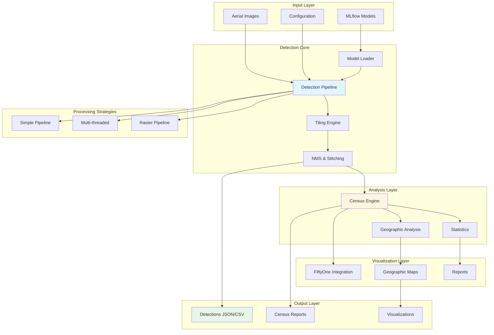

# WildDetect Architecture

WildDetect is the top-level application package that provides production-ready wildlife detection, census analysis, and geographic visualization capabilities.

## Overview

**Purpose**: Production detection system with census and analysis capabilities

**Key Responsibilities**:
- Wildlife detection on aerial imagery
- Census campaign orchestration
- Geographic analysis and visualization
- Population statistics and reporting
- Integration with FiftyOne and Label Studio

## Architecture Diagram



## Core Components

### 1. Detection Pipelines

Multiple pipeline strategies for different use cases.

#### Base Pipeline Interface
```python
# src/wildetect/core/pipeline/base.py
from abc import ABC, abstractmethod

class DetectionPipeline(ABC):
    """Base detection pipeline interface."""
    
    def __init__(
        self,
        model_path: Optional[str] = None,
        mlflow_model_name: Optional[str] = None,
        device: str = "cuda"
    ):
        self.device = device
        self.model = self._load_model(model_path, mlflow_model_name)
    
    @abstractmethod
    def detect(self, image_path: str) -> DetectionResult:
        """Detect objects in single image."""
        pass
    
    @abstractmethod
    def detect_batch(self, image_paths: List[str]) -> List[DetectionResult]:
        """Detect objects in batch of images."""
        pass
    
    def _load_model(self, model_path, mlflow_model_name):
        """Load model from file or MLflow."""
        if mlflow_model_name:
            return self._load_from_mlflow(mlflow_model_name)
        return self._load_from_file(model_path)
```

#### Simple Pipeline
```python
# src/wildetect/core/pipeline/simple.py
class SimplePipeline(DetectionPipeline):
    """Simple sequential pipeline."""
    
    def detect_batch(self, image_paths: List[str]) -> List[DetectionResult]:
        """Process images sequentially."""
        results = []
        for image_path in tqdm(image_paths):
            result = self.detect(image_path)
            results.append(result)
        return results
```

#### Multi-threaded Pipeline
```python
# src/wildetect/core/pipeline/multithreaded.py
from concurrent.futures import ThreadPoolExecutor
from queue import Queue

class MultiThreadedPipeline(DetectionPipeline):
    """Multi-threaded pipeline for parallel processing."""
    
    def __init__(self, num_data_workers: int = 2, queue_size: int = 64, **kwargs):
        super().__init__(**kwargs)
        self.num_data_workers = num_data_workers
        self.queue_size = queue_size
    
    def detect_batch(self, image_paths: List[str]) -> List[DetectionResult]:
        """Process images using thread pool."""
        with ThreadPoolExecutor(max_workers=self.num_data_workers) as executor:
            results = list(executor.map(self.detect, image_paths))
        return results
```

#### Raster Pipeline
```python
# src/wildetect/core/pipeline/raster.py
class RasterPipeline(DetectionPipeline):
    """Pipeline for large raster images (GeoTIFF, etc.)."""
    
    def __init__(
        self,
        tile_size: int = 800,
        overlap_ratio: float = 0.2,
        gsd: Optional[float] = None,  # Ground Sample Distance
        **kwargs
    ):
        super().__init__(**kwargs)
        self.tile_size = tile_size
        self.overlap_ratio = overlap_ratio
        self.gsd = gsd
        self.tiler = RasterTiler(tile_size, overlap_ratio)
        self.stitcher = DetectionStitcher(nms_threshold=0.5)
    
    def detect(self, raster_path: str) -> DetectionResult:
        """Detect objects in large raster image."""
        # 1. Tile the raster
        tiles = self.tiler.tile_raster(raster_path)
        
        # 2. Detect on each tile
        tile_detections = []
        for tile in tqdm(tiles, desc="Processing tiles"):
            detections = self._detect_tile(tile)
            tile_detections.append(detections)
        
        # 3. Stitch detections together
        stitched = self.stitcher.stitch(tile_detections, tiles)
        
        # 4. Convert to geographic coordinates if GSD provided
        if self.gsd:
            stitched = self._convert_to_geographic(stitched)
        
        return stitched
```

### 2. Tiling Engine

Handle large image tiling and stitching.

```python
# src/wildetect/core/tiling/tiler.py
import rasterio
from rasterio.windows import Window

class RasterTiler:
    """Tile large raster images."""
    
    def __init__(self, tile_size: int = 800, overlap_ratio: float = 0.2):
        self.tile_size = tile_size
        self.overlap = int(tile_size * overlap_ratio)
        self.stride = tile_size - self.overlap
    
    def tile_raster(self, raster_path: str) -> List[TileInfo]:
        """Generate tiles from raster."""
        tiles = []
        
        with rasterio.open(raster_path) as src:
            width, height = src.width, src.height
            
            for y in range(0, height, self.stride):
                for x in range(0, width, self.stride):
                    # Calculate window
                    w = min(self.tile_size, width - x)
                    h = min(self.tile_size, height - y)
                    
                    window = Window(x, y, w, h)
                    
                    # Read tile
                    tile_data = src.read(window=window)
                    
                    tiles.append(TileInfo(
                        data=tile_data,
                        window=window,
                        x_offset=x,
                        y_offset=y,
                        transform=src.window_transform(window)
                    ))
        
        return tiles
```

```python
# src/wildetect/core/tiling/stitcher.py
class DetectionStitcher:
    """Stitch tile detections together."""
    
    def __init__(self, nms_threshold: float = 0.5):
        self.nms_threshold = nms_threshold
    
    def stitch(
        self,
        tile_detections: List[List[Detection]],
        tiles: List[TileInfo]
    ) -> List[Detection]:
        """Stitch detections from tiles."""
        # 1. Convert tile coordinates to global coordinates
        global_detections = []
        for detections, tile in zip(tile_detections, tiles):
            for det in detections:
                # Adjust bbox to global coordinates
                det.bbox[0] += tile.x_offset
                det.bbox[1] += tile.y_offset
                global_detections.append(det)
        
        # 2. Apply NMS to remove duplicates at boundaries
        final_detections = self._apply_nms(global_detections)
        
        return final_detections
    
    def _apply_nms(self, detections: List[Detection]) -> List[Detection]:
        """Apply Non-Maximum Suppression."""
        # Group by class
        by_class = {}
        for det in detections:
            if det.class_name not in by_class:
                by_class[det.class_name] = []
            by_class[det.class_name].append(det)
        
        # Apply NMS per class
        final = []
        for class_name, dets in by_class.items():
            nms_dets = self._nms_class(dets)
            final.extend(nms_dets)
        
        return final
```

### 3. Census System

Orchestrate wildlife census campaigns.

```python
# src/wildetect/core/census/census_engine.py
from dataclasses import dataclass
from typing import Dict, List

@dataclass
class CensusConfig:
    campaign_name: str
    target_species: List[str]
    flight_specs: FlightSpecs
    coverage_area: Optional[Polygon] = None

class CensusEngine:
    """Census campaign orchestrator."""
    
    def __init__(self, config: CensusConfig, detection_pipeline: DetectionPipeline):
        self.config = config
        self.pipeline = detection_pipeline
        self.statistics = StatisticsCalculator()
        self.geographic = GeographicAnalyzer()
    
    def run_census(self, image_dir: str) -> CensusResult:
        """Run complete census campaign."""
        # 1. Discover images
        images = self._discover_images(image_dir)
        
        # 2. Run detection
        detections = self.pipeline.detect_batch(images)
        
        # 3. Calculate statistics
        stats = self.statistics.calculate(detections, self.config.target_species)
        
        # 4. Geographic analysis
        geographic = self.geographic.analyze(detections, self.config.flight_specs)
        
        # 5. Generate report
        report = self._generate_report(stats, geographic)
        
        return CensusResult(
            campaign_name=self.config.campaign_name,
            statistics=stats,
            geographic=geographic,
            detections=detections,
            report=report
        )
```

### 4. Statistics Calculator

Compute population statistics.

```python
# src/wildetect/core/census/statistics.py
class StatisticsCalculator:
    """Calculate census statistics."""
    
    def calculate(
        self,
        detections: List[DetectionResult],
        target_species: List[str]
    ) -> CensusStatistics:
        """Calculate comprehensive statistics."""
        stats = CensusStatistics()
        
        # Total counts per species
        stats.total_counts = self._count_by_species(detections)
        
        # Counts per image
        stats.counts_per_image = self._counts_per_image(detections)
        
        # Density analysis
        stats.density = self._calculate_density(detections)
        
        # Confidence distribution
        stats.confidence_dist = self._confidence_distribution(detections)
        
        # Species co-occurrence
        stats.co_occurrence = self._species_co_occurrence(detections)
        
        return stats
    
    def _count_by_species(self, detections: List[DetectionResult]) -> Dict[str, int]:
        """Count detections per species."""
        counts = {}
        for result in detections:
            for det in result.detections:
                counts[det.class_name] = counts.get(det.class_name, 0) + 1
        return counts
```

### 5. Geographic Analyzer

Analyze geographic distribution.

```python
# src/wildetect/core/geographic/analyzer.py
from shapely.geometry import Point, Polygon
from shapely.ops import unary_union

class GeographicAnalyzer:
    """Analyze geographic distribution of detections."""
    
    def analyze(
        self,
        detections: List[DetectionResult],
        flight_specs: FlightSpecs
    ) -> GeographicAnalysis:
        """Perform geographic analysis."""
        # 1. Extract GPS coordinates
        gps_data = self._extract_gps(detections)
        
        # 2. Calculate coverage area
        coverage = self._calculate_coverage(gps_data)
        
        # 3. Create distribution map
        distribution = self._create_distribution_map(detections, gps_data)
        
        # 4. Flight path analysis
        flight_path = self._analyze_flight_path(gps_data)
        
        # 5. Hotspot detection
        hotspots = self._detect_hotspots(detections, gps_data)
        
        return GeographicAnalysis(
            coverage_area=coverage,
            distribution_map=distribution,
            flight_path=flight_path,
            hotspots=hotspots,
            total_area_surveyed=coverage.area
        )
```

### 6. FiftyOne Integration

Integrate with FiftyOne for visualization.

```python
# src/wildetect/core/fiftyone/manager.py
import fiftyone as fo

class FiftyOneManager:
    """Manage FiftyOne datasets."""
    
    def create_dataset(
        self,
        name: str,
        detections: List[DetectionResult],
        image_dir: str
    ) -> fo.Dataset:
        """Create FiftyOne dataset from detections."""
        # Create dataset
        dataset = fo.Dataset(name)
        
        # Add samples
        samples = []
        for result in detections:
            sample = fo.Sample(filepath=result.image_path)
            
            # Add detections
            detections_fo = []
            for det in result.detections:
                detections_fo.append(
                    fo.Detection(
                        label=det.class_name,
                        bounding_box=self._convert_bbox(det.bbox),
                        confidence=det.confidence
                    )
                )
            
            sample["detections"] = fo.Detections(detections=detections_fo)
            samples.append(sample)
        
        dataset.add_samples(samples)
        return dataset
    
    def launch_app(self, dataset_name: str, port: int = 5151):
        """Launch FiftyOne app."""
        dataset = fo.load_dataset(dataset_name)
        session = fo.launch_app(dataset, port=port)
        return session
```

## CLI Interface

```python
# src/wildetect/cli/detect.py
import typer

app = typer.Typer()

@app.command()
def detect(
    images: str = typer.Argument(..., help="Image path or directory"),
    model: Optional[str] = typer.Option(None, "--model", "-m"),
    config: Optional[str] = typer.Option(None, "--config", "-c"),
    output: str = typer.Option("results/", "--output", "-o")
):
    """Run wildlife detection."""
    
@app.command()
def census(
    campaign_name: str = typer.Argument(...),
    images: str = typer.Argument(...),
    config: str = typer.Option(..., "--config", "-c"),
    output: str = typer.Option("results/", "--output", "-o")
):
    """Run census campaign."""
    
@app.command()
def analyze(
    results: str = typer.Argument(..., help="Detection results JSON"),
    output: str = typer.Option("analysis/", "--output", "-o")
):
    """Analyze detection results."""
    
@app.command()
def visualize(
    results: str = typer.Argument(...),
    output: str = typer.Option("visualizations/", "--output", "-o")
):
    """Create visualizations."""
```

## Configuration Files

### Detection Configuration

```yaml
# config/detection.yaml
model:
  mlflow_model_name: "detector"
  mlflow_model_alias: "production"
  device: "cuda"

processing:
  batch_size: 32
  tile_size: 800
  overlap_ratio: 0.2
  pipeline_type: "raster"  # simple, multithreaded, raster
  queue_size: 64
  num_data_workers: 2
  nms_threshold: 0.5

flight_specs:
  sensor_height: 24  # mm
  focal_length: 35.0  # mm
  flight_height: 180.0  # meters
  gsd: 2.38  # cm/px (Ground Sample Distance)

output:
  directory: "results"
  dataset_name: "detections_fiftyone"  # null to disable FiftyOne
  save_visualizations: true
```

### Census Configuration

```yaml
# config/census.yaml
campaign:
  name: "Summer_2024_Survey"
  target_species: ["elephant", "giraffe", "zebra"]
  area_name: "Serengeti_North"

model:
  mlflow_model_name: "detector"
  mlflow_model_alias: "production"

flight_specs:
  flight_height: 120.0
  gsd: 2.38

analysis:
  calculate_density: true
  detect_hotspots: true
  create_maps: true

output:
  directory: "census_results"
  generate_pdf_report: true
```

## Use Cases

### 1. Simple Detection

```python
from wildetect import DetectionPipeline

pipeline = DetectionPipeline(model_path="detector.pt", device="cuda")
results = pipeline.detect_batch("images/")

# Save results
pipeline.save_results(results, "results.json")
```

### 2. Census Campaign

```python
from wildetect import CensusEngine, CensusConfig

config = CensusConfig.from_yaml("config/census.yaml")
engine = CensusEngine(config)

census_result = engine.run_census("survey_images/")

# Generate report
census_result.save_report("census_report.pdf")
```

### 3. Large Raster Detection

```python
from wildetect import RasterPipeline

pipeline = RasterPipeline(
    model_path="detector.pt",
    tile_size=800,
    overlap_ratio=0.2,
    gsd=2.38  # cm/px
)

# Detect on large GeoTIFF
results = pipeline.detect("large_ortho.tif")
```

## Next Steps

- [Data Flow Details →](data-flow.md)
- [Detection Tutorial →](../tutorials/end-to-end-detection.md)
- [Census Tutorial →](../tutorials/census-campaign.md)
- [WildDetect Scripts →](../scripts/wildetect/index.md)

