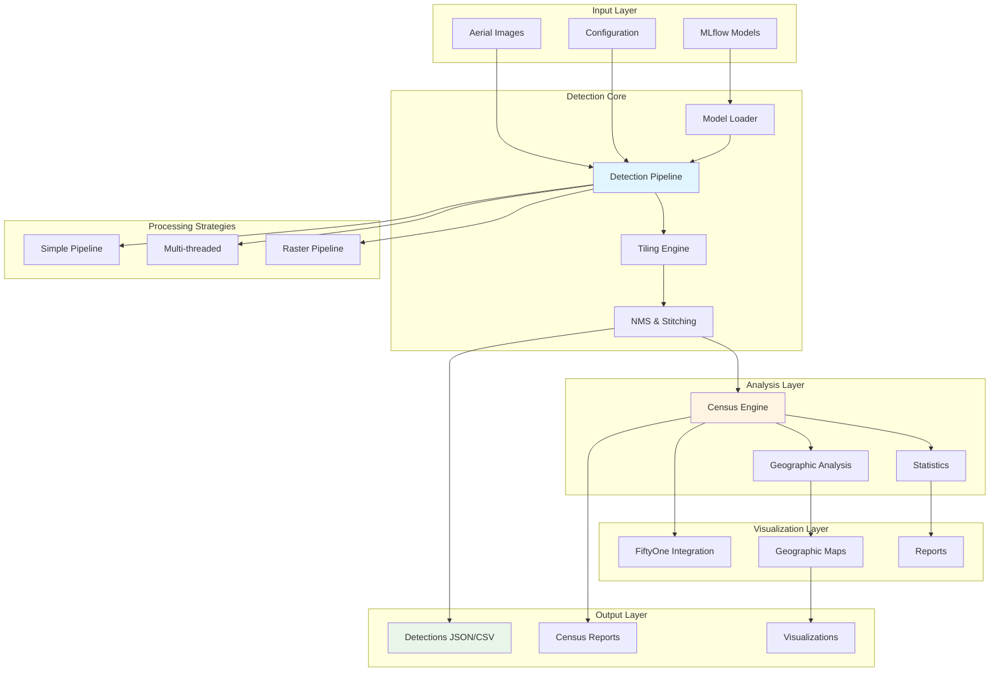

# WildDetect Architecture

WildDetect is the top-level application package that provides production-ready wildlife detection, census analysis, and geographic visualization capabilities.

## Overview

**Purpose**: Production detection system with census and analysis capabilities

**Key Responsibilities**:
- Wildlife detection on aerial imagery
- Census campaign orchestration
- Geographic analysis and visualization
- Population statistics and reporting
- Integration with FiftyOne and Label Studio

## Architecture Diagram


```mermaid
graph TB
    subgraph "Input Layer"
        A[Aerial Images]
        B[MLflow Models]
        C[Configuration]
    end
    
    subgraph "Detection Core"
        D[Model Loader]
        E[Detection Pipeline]
        F[Tiling Engine]
        G[NMS & Stitching]
    end
    
    subgraph "Processing Strategies"
        H[Simple Pipeline]
        I[Multi-threaded]
        J[Raster Pipeline]
    end
    
    subgraph "Analysis Layer"
        K[Census Engine]
        L[Statistics]
        M[Geographic Analysis]
    end
    
    subgraph "Visualization Layer"
        N[FiftyOne Integration]
        O[Geographic Maps]
        P[Reports]
    end
    
    subgraph "Output Layer"
        Q[Detections JSON/CSV]
        R[Census Reports]
        S[Visualizations]
    end
    
    A --> E
    B --> D
    C --> E
    D --> E
    E --> F
    F --> G
    E --> H
    E --> I
    E --> J
    G --> K
    K --> L
    K --> M
    L --> P
    M --> O
    K --> N
    G --> Q
    K --> R
    O --> S
    
    style E fill:#e1f5ff
    style K fill:#fff4e1
    style Q fill:#e8f5e9
```

## Core Components

### 1. Detection Pipelines

Multiple pipeline strategies for different use cases.

#### Detection Pipeline Strategies
The system supports multiple pipeline strategies for different hardware and data types:
- **Simple Pipeline**: Sequential processing for small datasets or debugging.
- **Multi-threaded Pipeline**: Parallel processing using a thread pool for improved throughput on multi-core CPUs.
- **Raster Pipeline**: Specialized for large GeoTIFF or orthomosaic files, featuring tiling and geographic coordinate conversion.

- **Tiling Engine**: Handles image fragmentation for large rasters.
- **NMS & Stitching**: Merges detections from overlapping tiles and applies Non-Maximum Suppression.

### 2. Tiling Engine

Handle large image tiling and stitching.

```python
The engine slices large rasters into manageable windows, processes them through the detection pipeline, and then restores global coordinates while removing duplicates at tile boundaries.

### 3. Census System

Orchestrate wildlife census campaigns.

```python
Orchestrates census campaigns by coordinating multi-image detection, population statistics calculation, and report generation.

### 4. Statistics Calculator

Compute population statistics.

```python
Computes metadata-derived statistics, density maps, and species distribution charts.

### 5. Geographic Analyzer

Analyze geographic distribution.

```python
# src/wildetect/core/geographic/analyzer.py
from shapely.geometry import Point, Polygon
from shapely.ops import unary_union

Processes EXIF GPS data to map detections to world coordinates, detect population hotspots, and calculate survey coverage area.

### 6. FiftyOne Integration

Integrate with FiftyOne for visualization.

```python
# src/wildetect/core/fiftyone/manager.py
import fiftyone as fo

Automates the creation of FiftyOne datasets from pipeline results for interactive review.

## CLI Interface

```python
The CLI is built with Typer and provides commands for detection, census, analysis, and visualization. Complete command documentation is available in the [CLI Reference](../api-reference/wildetect-cli.md).

## Configuration Files

### Detection Configuration

```yaml
# config/detection.yaml
model:
  mlflow_model_name: "detector"
  mlflow_model_alias: "production"
  device: "cuda"

processing:
  batch_size: 32
  tile_size: 800
  overlap_ratio: 0.2
  pipeline_type: "raster"  # simple, multithreaded, raster
  queue_size: 64
  num_data_workers: 2
  nms_threshold: 0.5

flight_specs:
  sensor_height: 24  # mm
  focal_length: 35.0  # mm
  flight_height: 180.0  # meters
  gsd: 2.38  # cm/px (Ground Sample Distance)

output:
  directory: "results"
  dataset_name: "detections_fiftyone"  # null to disable FiftyOne
  save_visualizations: true
```

### Census Configuration

```yaml
# config/census.yaml
campaign:
  name: "Summer_2024_Survey"
  target_species: ["elephant", "giraffe", "zebra"]
  area_name: "Serengeti_North"

model:
  mlflow_model_name: "detector"
  mlflow_model_alias: "production"

flight_specs:
  flight_height: 120.0
  gsd: 2.38

analysis:
  calculate_density: true
  detect_hotspots: true
  create_maps: true

output:
  directory: "census_results"
  generate_pdf_report: true
```


## Next Steps

- [Data Flow Details →](data-flow.md)
- [Detection Tutorial →](../tutorials/end-to-end-detection.md)
- [Census Tutorial →](../tutorials/census-campaign.md)
- [WildDetect Scripts →](../scripts/wildetect/index.md)

