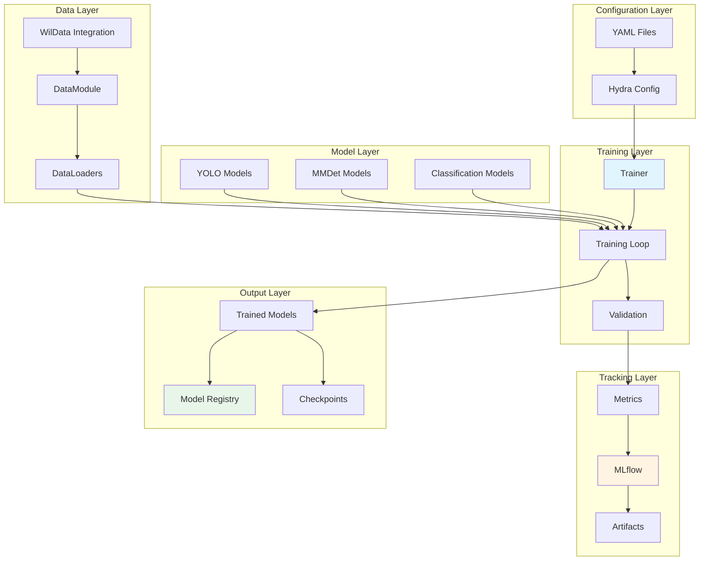

# WildTrain Architecture

WildTrain is a modular training framework that supports both object detection (YOLO, MMDetection) and classification (PyTorch Lightning) with integrated experiment tracking and model management.

## Overview

**Purpose**: Flexible model training and evaluation framework

**Key Responsibilities**:
- Model training (detection and classification)
- Experiment tracking with MLflow
- Hyperparameter optimization
- Model evaluation and metrics
- Model registration and versioning

## Architecture Diagram



## Core Components

### 1. Model Architectures

#### YOLO Detection
```python
# src/wildtrain/models/detection/yolo_model.py
from ultralytics import YOLO

class YOLODetector:
    """YOLO-based object detector."""
    
    def __init__(self, model_size: str = "n"):
        self.model = YOLO(f"yolo11{model_size}.pt")
    
    def train(self, data_yaml: str, **kwargs):
        """Train YOLO model."""
        results = self.model.train(
            data=data_yaml,
            epochs=kwargs.get('epochs', 100),
            imgsz=kwargs.get('imgsz', 640),
            batch=kwargs.get('batch', 16)
        )
        return results
    
    def validate(self, data_yaml: str):
        """Validate model."""
        return self.model.val(data=data_yaml)
```

#### MMDetection
```python
# src/wildtrain/models/detection/mmdet_model.py
from mmdet.apis import init_detector, train_detector
from mmdet.apis import inference_detector

class MMDetDetector:
    """MMDetection-based detector."""
    
    def __init__(self, config: str, checkpoint: Optional[str] = None):
        self.config = config
        self.model = init_detector(config, checkpoint) if checkpoint else None
    
    def train(self, config_file: str, work_dir: str):
        """Train MMDet model."""
        from mmcv import Config
        cfg = Config.fromfile(config_file)
        train_detector(self.model, cfg, distributed=False)
```

#### Classification Models
```python
# src/wildtrain/models/classification/classifier.py
import pytorch_lightning as pl
import torchvision.models as models

class ImageClassifier(pl.LightningModule):
    """PyTorch Lightning classifier."""
    
    def __init__(
        self,
        architecture: str = "resnet50",
        num_classes: int = 10,
        learning_rate: float = 0.001
    ):
        super().__init__()
        self.save_hyperparameters()
        
        # Load pretrained model
        self.model = getattr(models, architecture)(pretrained=True)
        
        # Replace final layer
        in_features = self.model.fc.in_features
        self.model.fc = nn.Linear(in_features, num_classes)
        
        self.criterion = nn.CrossEntropyLoss()
    
    def forward(self, x):
        return self.model(x)
    
    def training_step(self, batch, batch_idx):
        x, y = batch
        logits = self(x)
        loss = self.criterion(logits, y)
        self.log('train_loss', loss)
        return loss
    
    def validation_step(self, batch, batch_idx):
        x, y = batch
        logits = self(x)
        loss = self.criterion(logits, y)
        acc = (logits.argmax(dim=1) == y).float().mean()
        self.log('val_loss', loss)
        self.log('val_acc', acc)
    
    def configure_optimizers(self):
        return torch.optim.Adam(self.parameters(), lr=self.hparams.learning_rate)
```

### 2. Data Modules

#### Detection DataModule
```python
# src/wildtrain/data/detection_datamodule.py
from pytorch_lightning import LightningDataModule
from torch.utils.data import DataLoader

class DetectionDataModule(LightningDataModule):
    """DataModule for detection datasets."""
    
    def __init__(
        self,
        data_root: str,
        batch_size: int = 32,
        num_workers: int = 4
    ):
        super().__init__()
        self.data_root = data_root
        self.batch_size = batch_size
        self.num_workers = num_workers
    
    def setup(self, stage: Optional[str] = None):
        # Load datasets using WilData
        from wildata import DataPipeline
        pipeline = DataPipeline(self.data_root)
        
        if stage == "fit":
            self.train_dataset = pipeline.load_dataset("train")
            self.val_dataset = pipeline.load_dataset("val")
        
        if stage == "test":
            self.test_dataset = pipeline.load_dataset("test")
    
    def train_dataloader(self):
        return DataLoader(
            self.train_dataset,
            batch_size=self.batch_size,
            num_workers=self.num_workers,
            shuffle=True
        )
    
    def val_dataloader(self):
        return DataLoader(
            self.val_dataset,
            batch_size=self.batch_size,
            num_workers=self.num_workers
        )
```

#### Classification DataModule
```python
# src/wildtrain/data/classification_datamodule.py
class ClassificationDataModule(LightningDataModule):
    """DataModule for classification datasets."""
    
    def __init__(
        self,
        data_root: str,
        image_size: int = 224,
        batch_size: int = 32,
        num_workers: int = 4
    ):
        super().__init__()
        self.data_root = data_root
        self.image_size = image_size
        self.batch_size = batch_size
        self.num_workers = num_workers
        
        # Define transforms
        self.train_transform = transforms.Compose([
            transforms.Resize((image_size, image_size)),
            transforms.RandomHorizontalFlip(),
            transforms.ToTensor(),
            transforms.Normalize(mean=[0.485, 0.456, 0.406],
                               std=[0.229, 0.224, 0.225])
        ])
```

### 3. Training Orchestration

#### Main Trainer
```python
# src/wildtrain/trainers/trainer.py
from hydra.utils import instantiate
import mlflow

class Trainer:
    """Main training orchestrator."""
    
    def __init__(self, config: DictConfig):
        self.config = config
        self.model = instantiate(config.model)
        self.datamodule = instantiate(config.data)
    
    def train(self):
        """Execute training loop."""
        # Setup MLflow
        mlflow.set_experiment(self.config.experiment_name)
        
        with mlflow.start_run():
            # Log parameters
            mlflow.log_params(OmegaConf.to_container(self.config))
            
            # Create PyTorch Lightning trainer
            pl_trainer = pl.Trainer(
                max_epochs=self.config.training.epochs,
                accelerator=self.config.training.accelerator,
                devices=self.config.training.devices,
                callbacks=self._create_callbacks()
            )
            
            # Train
            pl_trainer.fit(self.model, self.datamodule)
            
            # Log metrics
            metrics = pl_trainer.callback_metrics
            mlflow.log_metrics({k: v.item() for k, v in metrics.items()})
            
            # Save model
            model_path = "trained_model"
            pl_trainer.save_checkpoint(model_path)
            mlflow.pytorch.log_model(self.model, "model")
            
        return self.model
    
    def _create_callbacks(self):
        """Create training callbacks."""
        from pytorch_lightning.callbacks import ModelCheckpoint, EarlyStopping
        
        return [
            ModelCheckpoint(
                monitor='val_loss',
                mode='min',
                save_top_k=3
            ),
            EarlyStopping(
                monitor='val_loss',
                patience=10,
                mode='min'
            )
        ]
```

### 4. Evaluation System

#### Metrics Computation
```python
# src/wildtrain/evaluation/metrics.py
from torchmetrics import Accuracy, Precision, Recall, F1Score

class ClassificationMetrics:
    """Compute classification metrics."""
    
    def __init__(self, num_classes: int):
        self.accuracy = Accuracy(num_classes=num_classes)
        self.precision = Precision(num_classes=num_classes, average='macro')
        self.recall = Recall(num_classes=num_classes, average='macro')
        self.f1 = F1Score(num_classes=num_classes, average='macro')
    
    def compute(self, predictions, targets):
        """Compute all metrics."""
        return {
            'accuracy': self.accuracy(predictions, targets),
            'precision': self.precision(predictions, targets),
            'recall': self.recall(predictions, targets),
            'f1': self.f1(predictions, targets)
        }
```

#### Detection Metrics
```python
# src/wildtrain/evaluation/detection_metrics.py
from torchmetrics.detection import MeanAveragePrecision

class DetectionMetrics:
    """Compute detection metrics."""
    
    def __init__(self):
        self.map_metric = MeanAveragePrecision()
    
    def compute(self, predictions, targets):
        """Compute mAP and related metrics."""
        self.map_metric.update(predictions, targets)
        results = self.map_metric.compute()
        
        return {
            'mAP': results['map'],
            'mAP_50': results['map_50'],
            'mAP_75': results['map_75']
        }
```

### 5. Hyperparameter Optimization

#### Optuna Integration
```python
# src/wildtrain/tuning/optuna_tuner.py
import optuna
from optuna.integration import PyTorchLightningPruningCallback

class OptunaTuner:
    """Hyperparameter tuning with Optuna."""
    
    def __init__(self, config: DictConfig):
        self.config = config
        self.study = optuna.create_study(
            direction="minimize",
            study_name=config.study_name,
            storage=config.storage
        )
    
    def objective(self, trial: optuna.Trial) -> float:
        """Optimization objective."""
        # Suggest hyperparameters
        lr = trial.suggest_loguniform('learning_rate', 1e-5, 1e-2)
        batch_size = trial.suggest_categorical('batch_size', [16, 32, 64])
        
        # Update config
        self.config.model.learning_rate = lr
        self.config.data.batch_size = batch_size
        
        # Train model
        trainer = Trainer(self.config)
        model = trainer.train()
        
        # Return validation loss
        return trainer.pl_trainer.callback_metrics['val_loss'].item()
    
    def tune(self, n_trials: int = 50):
        """Run hyperparameter tuning."""
        self.study.optimize(self.objective, n_trials=n_trials)
        
        print(f"Best trial: {self.study.best_trial.params}")
        return self.study.best_params
```

### 6. Model Registration

#### MLflow Model Registry
```python
# src/wildtrain/registry/model_registry.py
import mlflow
from mlflow.tracking import MlflowClient

class ModelRegistry:
    """Manage models in MLflow registry."""
    
    def __init__(self, tracking_uri: str):
        mlflow.set_tracking_uri(tracking_uri)
        self.client = MlflowClient()
    
    def register_model(
        self,
        model_path: str,
        model_name: str,
        description: Optional[str] = None,
        tags: Optional[Dict] = None
    ) -> str:
        """Register model to MLflow."""
        # Log model
        with mlflow.start_run():
            mlflow.pytorch.log_model(model_path, "model")
            run_id = mlflow.active_run().info.run_id
        
        # Register
        model_uri = f"runs:/{run_id}/model"
        mv = mlflow.register_model(model_uri, model_name)
        
        # Add description and tags
        if description:
            self.client.update_model_version(
                name=model_name,
                version=mv.version,
                description=description
            )
        
        if tags:
            for key, value in tags.items():
                self.client.set_model_version_tag(
                    name=model_name,
                    version=mv.version,
                    key=key,
                    value=value
                )
        
        return mv.version
    
    def load_model(self, model_name: str, version: Optional[str] = None):
        """Load model from registry."""
        if version:
            model_uri = f"models:/{model_name}/{version}"
        else:
            model_uri = f"models:/{model_name}/latest"
        
        return mlflow.pytorch.load_model(model_uri)
    
    def promote_model(self, model_name: str, version: str, stage: str):
        """Promote model to production stage."""
        self.client.transition_model_version_stage(
            name=model_name,
            version=version,
            stage=stage  # "Staging", "Production", "Archived"
        )
```

## Configuration System

### Hydra Configuration

WildTrain uses Hydra for flexible configuration management.

```python
# src/wildtrain/main.py
import hydra
from omegaconf import DictConfig

@hydra.main(config_path="configs", config_name="main", version_base="1.3")
def main(cfg: DictConfig):
    trainer = Trainer(cfg)
    trainer.train()

if __name__ == "__main__":
    main()
```

### Configuration Structure

```yaml
# configs/main.yaml
defaults:
  - model: yolo
  - data: detection
  - training: default
  - _self_

experiment_name: wildlife_detection
seed: 42

# Override from CLI:
# python main.py model=custom data.batch_size=64
```

### Model Configs

```yaml
# configs/detection/yolo.yaml
model:
  framework: "yolo"
  size: "n"  # n, s, m, l, x
  pretrained: true

training:
  epochs: 100
  imgsz: 640
  batch: 16
  optimizer: "AdamW"
  lr0: 0.001
```

## CLI Interface

```python
# src/wildtrain/cli/train.py
import typer
app = typer.Typer()

@app.command()
def train(
    task: str = typer.Option(..., help="Task type: classifier or detector"),
    config: str = typer.Option(..., "-c", "--config"),
    override: List[str] = typer.Option(None, "-o", "--override")
):
    """Train a model."""
    # Load config with overrides
    # Start training
    
@app.command()
def evaluate(
    task: str,
    config: str,
    checkpoint: str
):
    """Evaluate a trained model."""
    
@app.command()
def tune(
    config: str,
    n_trials: int = 50
):
    """Run hyperparameter tuning."""
```

## Use Cases

### 1. Train YOLO Detector

```bash
# Using CLI
wildtrain train detector -c configs/detection/yolo.yaml

# Using Python
from wildtrain import Trainer
trainer = Trainer.from_config("configs/detection/yolo.yaml")
model = trainer.train()
```

### 2. Train Classifier

```python
import pytorch_lightning as pl
from wildtrain import ImageClassifier, ClassificationDataModule

# Create model and data
model = ImageClassifier(architecture="resnet50", num_classes=10)
datamodule = ClassificationDataModule(data_root="data/classification")

# Create trainer
trainer = pl.Trainer(max_epochs=50, accelerator="gpu")

# Train
trainer.fit(model, datamodule)
```

### 3. Hyperparameter Tuning

```python
from wildtrain.tuning import OptunaTuner

tuner = OptunaTuner(config)
best_params = tuner.tune(n_trials=50)

print(f"Best hyperparameters: {best_params}")
```

### 4. Model Registration

```python
from wildtrain.registry import ModelRegistry

registry = ModelRegistry(tracking_uri="http://localhost:5000")

# Register model
version = registry.register_model(
    model_path="checkpoints/best.ckpt",
    model_name="wildlife_detector",
    description="YOLO model trained on aerial images",
    tags={"framework": "yolo", "dataset": "wildlife_v1"}
)

# Promote to production
registry.promote_model("wildlife_detector", version, "Production")
```

## Next Steps

- [WildDetect Architecture →](wildetect.md)
- [Data Flow Details →](data-flow.md)
- [Training Tutorial →](../tutorials/model-training.md)
- [WildTrain Scripts →](../scripts/wildtrain/index.md)

