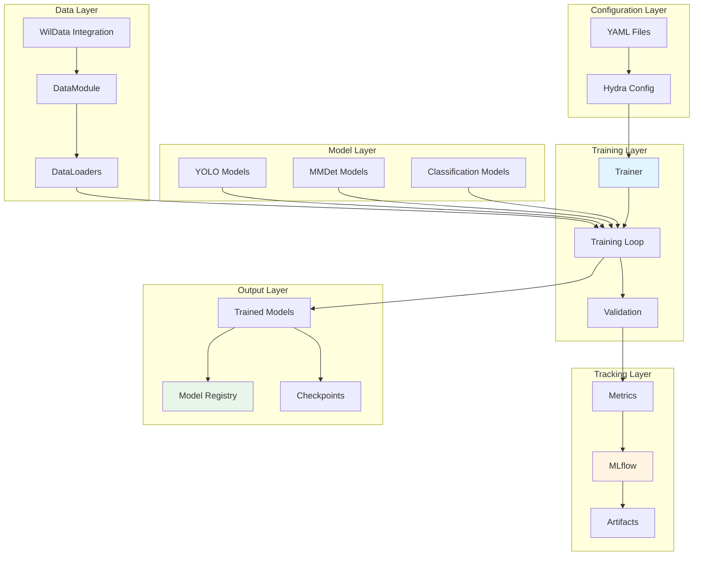

# WildTrain Architecture

WildTrain is a modular training framework that supports both object detection (YOLO, MMDetection) and classification (PyTorch Lightning) with integrated experiment tracking and model management.

## Overview

**Purpose**: Flexible model training and evaluation framework

**Key Responsibilities**:
- Model training (detection and classification)
- Experiment tracking with MLflow
- Hyperparameter optimization
- Model evaluation and metrics
- Model registration and versioning

## Architecture Diagram


```mermaid
graph TB
    subgraph "Configuration Layer"
        A[Hydra Config]
        B[YAML Files]
    end
    
    subgraph "Data Layer"
        C[WilData Integration]
        D[DataModule]
        E[DataLoaders]
    end
    
    subgraph "Model Layer"
        F[YOLO Models]
        G[MMDet Models]
        H[Classification Models]
    end
    
    subgraph "Training Layer"
        I[Trainer]
        J[Training Loop]
        K[Validation]
    end
    
    subgraph "Tracking Layer"
        L[MLflow]
        M[Metrics]
        N[Artifacts]
    end
    
    subgraph "Output Layer"
        O[Trained Models]
        P[Model Registry]
        Q[Checkpoints]
    end
    
    A --> I
    B --> A
    C --> D
    D --> E
    E --> J
    F --> J
    G --> J
    H --> J
    I --> J
    J --> K
    K --> M
    M --> L
    J --> O
    O --> P
    O --> Q
    L --> N
    
    style I fill:#e1f5ff
    style L fill:#fff4e1
    style P fill:#e8f5e9
```

## Core Components

### 1. Model Architectures

#### Supported Architectures
WildTrain supports several model families out of the box:
- **YOLO Detection**: Integrated Ultralytics YOLO models for fast and accurate object detection.
- **MMDetection**: Support for advanced detection architectures including Faster R-CNN, Mask R-CNN, and Transformers.
- **Classification Models**: PyTorch Lightning-based classifiers for species identification using standard backbones like ResNet, EfficientNet, and Vision Transformers.

### 2. Data Modules

#Standardized data loading components that integrate with WilData to feed training and validation batches into the models:
- **Detection DataModule**: Handles bounding box datasets and associated image transformations.
- **Classification DataModule**: Handles ROI-based classification datasets with standard image augmentations.

### 3. Training Orchestration

#### Main Trainer
The training orchestrator manages the lifecycle of a training run, including experiment initialization, model instantiation, training loop execution, and model serialization.

### 4. Evaluation System

#### Metrics Computation
Integrated tools for calculating standard performance metrics:
- **Classification Metrics**: Accuracy, Precision, Recall, and F1-Score.
- **Detection Metrics**: Mean Average Precision (mAP) at various IoU thresholds.

### 5. Hyperparameter Optimization

#### Optuna Integration
WildTrain integrates with Optuna to automate the search for optimal training hyperparameters like learning rate, batch size, and architectural configurations.

### 6. Model Registration

#### MLflow Model Registry
Models are automatically registered in the MLflow Model Registry, allowing for versioning, lifecycle stage management (Staging/Production), and metadata tracking.

## Configuration System

### Hydra Configuration

WildTrain uses Hydra for flexible configuration management.

WildTrain uses Hydra for flexible configuration management, enabling hierarchical YAML configurations and CLI-based overrides.

### Configuration Structure

```yaml
# configs/main.yaml
defaults:
  - model: yolo
  - data: detection
  - training: default
  - _self_

experiment_name: wildlife_detection
seed: 42

# Override from CLI:
# python main.py model=custom data.batch_size=64
```

### Model Configs

```yaml
# configs/detection/yolo.yaml
model:
  framework: "yolo"
  size: "n"  # n, s, m, l, x
  pretrained: true

training:
  epochs: 100
  imgsz: 640
  batch: 16
  optimizer: "AdamW"
  lr0: 0.001
```

## CLI Interface

Training, evaluation, and tuning operations are all exposed via a CLI built with Typer. Complete documentation is available in the [CLI Reference](../api-reference/wildtrain-cli.md).


## Next Steps

- [WildDetect Architecture →](wildetect.md)
- [Data Flow Details →](data-flow.md)
- [Training Tutorial →](../tutorials/model-training.md)
- [WildTrain Scripts →](../scripts/wildtrain/index.md)

