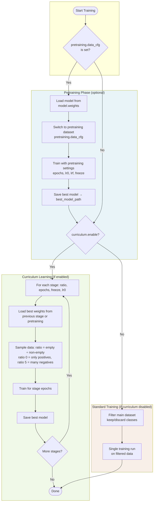

# Plain English Guide to the YOLO Training Config

This guide explains every setting in the YOLO training configuration file (`yolo.yaml`) in simple terms. It's intended for non-technical users who need to modify values for their training runs. The explanations are based on the actual Pydantic schemas and validation rules used by the codebase.

---

## **1. Dataset** — What Data Your Model Learns From

| Setting | What It Does | How to Change It |
|---------|--------------|------------------|
| **data_cfg** | Path to the file that describes your dataset (where images live, train/validation splits). | Change this to point to your own data config file, e.g. `D:\path\to\your\data.yaml`. |
| **root_data_directory** | Optional override: a base folder for all your images. | Leave as `null` to use paths from the data config, or set something like `D:\images` if your paths are relative to that folder. |
| **force_merge** | When using curriculum learning, whether to merge train and validation sets together before each stage. | `true` = merge them; `false` = keep them separate. |
| **keep_classes** | **Use ONLY these classes** — everything else becomes "background" and is ignored. | Provide a list like `["leopard", "buffalo"]`. **Important: You must use either `keep_classes` OR `discard_classes`, never both.** |
| **discard_classes** | **Remove these classes** — they become "background"; all other classes are kept. | Provide a list like `["rocks", "vegetation", "other"]`. **Use either `keep_classes` or `discard_classes`, never both.** |

---

## **2. Curriculum** — Staged Training (Learn in Steps)

Curriculum learning means the model trains in multiple stages instead of all at once.

| Setting | What It Does | How to Change It |
|---------|--------------|------------------|
| **enable** | Turn curriculum learning on or off. | `true` = use staged training; `false` = train normally in one go. |
| **ratios** | Difficulty or sampling ratios for each stage (e.g. "easy" vs "hard" images). | Usually keep as `[0., 1., 2.5, 5.]` unless you know what you're changing. |
| **epochs** | How many epochs (full passes through the data) for each stage. | Example: `[10, 10, 5, 5]` means 10 epochs for stages 1–2, 5 epochs for stages 3–4. Add or remove numbers to add/remove stages. |
| **freeze** | How many model layers to freeze (leave unchanged) during each stage. | Higher = less training, faster but simpler. |
| **lr0s** | Learning rate for each stage. | Smaller values (e.g. `0.00005`) = slower, more stable. Larger (e.g. `0.0001`) = faster but riskier. |
| **save_dir** | Where to save checkpoints after each curriculum stage. | Set a path like `D:\checkpoints\curriculum`, or `null` for default. |

---

## **3. Pretraining** — Optional Warm-Up Phase

| Setting | What It Does | How to Change It |
|---------|--------------|------------------|
| **data_cfg** | Path to a separate dataset used for pretraining. | Set a path if you want pretraining; leave `null` to skip. |
| **epochs** | How many epochs to pretrain. | Increase for more pretraining (e.g. 15–20); decrease or set data_cfg to null to skip. |
| **lr0** | Starting learning rate for pretraining. | Lower = more careful; higher = faster. |
| **lrf** | Final learning rate as a fraction of the starting rate (e.g. `0.1` = 10% of start). | Typical: `0.01`–`0.1`. |
| **freeze** | How many layers to freeze during pretraining. | Same idea as curriculum freeze. |
| **save_dir** | Where to save the pretrained model. | Set a path or leave `null`. |

---

## **4. Model** — Which YOLO Model to Use

| Setting | What It Does | How to Change It |
|---------|--------------|------------------|
| **pretrained** | Start from a model that was already trained on other data. | `true` = use pretrained weights (recommended); `false` = train from scratch. |
| **weights** | Filename or path of the pretrained weights file. | Examples: `yolo12s.pt` (smaller, faster), `yolo12m.pt` (larger, more accurate). |
| **architecture_file** | Custom model architecture definition. | Leave `null` unless you have a custom YOLO setup. |

---

## **5. Run Name and Project**

| Setting | What It Does |
|---------|--------------|
| **name** | A short label for this run (e.g. in logs and checkpoints). |
| **project** | The project or experiment group name. |

---

## **6. MLflow** — Experiment Tracking

| Setting | What It Does |
|---------|--------------|
| **tracking_uri** | URL of your MLflow server for logging experiments. Change if your server runs elsewhere. |

---

## **7. Custom YOLO** — Advanced (When use_custom_yolo is True)

Only applies when **use_custom_yolo** is `true`. These control a custom model variant.

| Setting | What It Does |
|---------|--------------|
| **image_encoder_backbone** | Backbone model for the image encoder (e.g. DINOv2). |
| **image_encoder_backbone_source** | Where the backbone comes from (e.g. `timm`). |
| **count_regressor_layers** | Number of layers in the count regressor. |
| **area_regressor_layers** | Number of layers in the area regressor. |
| **roi_classifier_layers** | Layer config per feature level (e.g. `{"p3": 13, "p4": 10}`). |
| **fp_tp_loss_weight** | Weight for false-positive/true-positive loss. |
| **count_loss_weight** | Weight for count prediction loss. |
| **area_loss_weight** | Weight for area prediction loss. |
| **box_size** | Size of region-of-interest boxes in pixels. |

---

## **8. Train** — Main Training Settings

### Core Settings

| Setting | What It Does | Valid Values / Constraints |
|---------|--------------|----------------------------|
| **batch** | How many images to process per training step. | Higher = faster but needs more memory. Lower (e.g. 16, 32) if you run out of memory. |
| **epochs** | How many times to go through the whole dataset. | More = longer training. Typical: 25–100. |
| **optimizer** | Algorithm that updates the model. | **Must be one of:** `AdamW`, `Adam`, `SGD`, `RMSprop`. |
| **lr0** | Starting learning rate. | Lower = slower, more stable. Higher = faster but riskier. Typical: 0.00001–0.001. |
| **lrf** | Final learning rate as fraction of start (e.g. `0.1` = 10%). | Typical: 0.01–0.1. |
| **momentum** | How much past updates influence the current one. | Typical: 0.9–0.99. |
| **weight_decay** | Regularization strength. | Typical: 0.0001–0.001. |
| **warmup_epochs** | Epochs where learning rate ramps up from 0. | Often 0–3. |
| **cos_lr** | Use cosine learning rate schedule (gradual decrease). | `true` or `false`. |
| **patience** | Stop training if no improvement for this many epochs. | Higher = more patience. Typical: 10–20. |
| **iou** | IoU threshold for detection matching. | **Must be between 0.0 and 1.0.** |
| **imgsz** | Size of input images (width and height) in pixels. | **Must be positive.** 640 or 800 common. Larger = slower but sometimes more accurate. |
| **single_cls** | Treat all objects as one class — trains as a **localizer** (find boxes, not classify). | `true` for single-class/localizer; `false` for multi-class. |
| **device** | Where to run training. | `"cpu"` or `"cuda"` (GPU). Must match what you have. |
| **workers** | Number of parallel data loaders. | **Must be ≥ 0.** 0 often works on Windows. |
| **freeze** | How many backbone layers to freeze. | 0 = train all; higher = fewer trainable layers. |

### Loss Weights

| Setting | What It Does |
|---------|--------------|
| **box** | Weight for bounding box accuracy. |
| **cls** | Weight for class prediction. |
| **dfl** | Weight for box refinement (DFL loss). |

### Augmentations — Artificial Variations to Improve Robustness

| Setting | What It Does |
|---------|--------------|
| **degrees** | Max random rotation in degrees. |
| **mixup** | Probability of blending two images. |
| **cutmix** | Probability of cut-and-paste augmentation. |
| **shear** | Shear distortion strength. |
| **copy_paste** | Probability of copy-paste augmentation. |
| **erasing** | Probability of random erasing. |
| **scale** | Random zoom range (e.g. 0.2 = ±20%). |
| **fliplr** | Probability of horizontal flip. |
| **flipud** | Probability of vertical flip. |
| **hsv_h, hsv_s, hsv_v** | Color/brightness jitter (hue, saturation, value). |
| **translate** | Random horizontal/vertical shift. |
| **mosaic** | Probability of 4-image mosaic. |
| **multi_scale** | Use multiple image scales. |
| **perspective** | Perspective distortion. |

### Other

| Setting | What It Does |
|---------|--------------|
| **deterministic** | Make runs reproducible (same random choices). |
| **seed** | Random seed — same seed = same results. |
| **cache** | Cache images in RAM for faster loading (uses more memory). |

---

## Rules Enforced by the Code

1. **keep_classes vs discard_classes** — You must provide exactly one. Using both or neither will cause an error.
2. **optimizer** — Must be one of: `AdamW`, `Adam`, `SGD`, `RMSprop`.
3. **device** — Must be `"cpu"` or a string containing `"cuda"`.
4. **iou** — Must be between 0.0 and 1.0.
5. **single_cls** — When `true`, the model trains as a **localizer** (finding object boxes, not classifying species).

---

## Quick Tips for Beginners

1. **Single species detection?** Use `single_cls: true` and set either `keep_classes` or `discard_classes` accordingly.
2. **Out of memory?** Lower `batch` (e.g. 16 or 8) and/or `imgsz`.
3. **Want faster training?** Use `device: "cuda"` and increase `batch` if your GPU allows.
4. **Need reproducible runs?** Set `deterministic: true` and pick a fixed `seed`.
5. **Different species or classes?** Change `keep_classes` or `discard_classes` (remember: one or the other, not both).
6. **Tracking experiments?** Change `name` and `project` so you can tell runs apart.

---

## Training Flow: Pretraining and Curriculum Learning

The diagram below shows how pretraining and curriculum learning work together when you run detection training.

### What the flow means

1. **Pretraining** (optional)  
   If `pretraining.data_cfg` is set, the model first trains on a different dataset using `pretraining.epochs`, `pretraining.lr0`, `pretraining.lrf`, and `pretraining.freeze`. The best checkpoint is saved and used for the next phase.

2. **Curriculum learning**  
   If `curriculum.enable` is `true`, training runs in stages. At each stage:
   - The best model from the previous stage (or pretraining) is loaded.
   - A subset of the main dataset is sampled with a given **ratio** (empty images ÷ images with animals).
   - The model is trained for that stage’s `epochs` with that stage’s `lr0` and `freeze`.

3. **Ratio progression** (e.g. with `ratios: [0., 1., 2.5, 5.]`)  
   - **ratio = 0**: Only images with animals — easiest.
   - **ratio = 1**: Equal numbers of empty and non-empty images.
   - **ratio = 2.5, 5**: More empty images, so the model sees more “no animal here” examples (harder).

4. **Standard training**  
   If `curriculum.enable` is `false`, the main dataset is filtered (by `keep_classes` or `discard_classes`) and one full training run is performed.

---

## Related Documentation

- [WildTrain Configuration Reference](index.md)
- [Model Training Tutorial](../../tutorials/model-training.md)
- [Dataset Preparation](../../tutorials/dataset-preparation.md)
