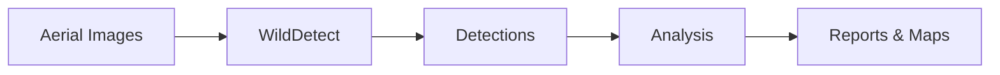
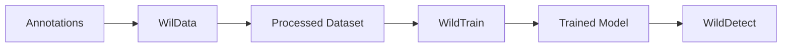
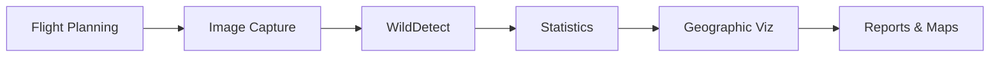

# WildDetect Monorepo Documentation

<div align="center">
  
</div>

Welcome to the comprehensive documentation for the **WildDetect** project - a complete wildlife monitoring and conservation toolkit for aerial imagery analysis.

## What is WildDetect?

WildDetect is an integrated ecosystem of three specialized packages designed to streamline the entire wildlife detection workflow, from data management to model training and deployment:

- **WilData** - Data pipeline and management
- **WildTrain** - Model training and evaluation  
- **WildDetect** - Detection deployment and census analysis

## Key Features

### 🎯 Complete Wildlife Detection Pipeline
- Multi-species detection using state-of-the-art YOLO models
- Batch processing of large-scale aerial imagery
- Automated census campaigns with population statistics
- Geographic visualization and analysis

### 📦 Comprehensive Data Management
- Import from COCO, YOLO, and Label Studio formats
- Data transformations (tiling, augmentation, filtering)
- DVC integration for dataset versioning
- ROI extraction for hard sample mining

### 🧠 Flexible Training Framework
- Support for YOLO and MMDetection frameworks
- Classification and object detection training
- MLflow experiment tracking
- Hyperparameter optimization with Optuna

### 🌍 Geographic Analysis
- GPS metadata extraction and management
- Flight path analysis and coverage maps
- Interactive visualizations with FiftyOne
- Population density and distribution analysis

## Quick Navigation

### For New Users
Start here to get up and running quickly:

- [Installation Guide](getting-started/installation.md) - Install all packages
- [Quick Start](getting-started/quick-start.md) - Your first detection
- [Environment Setup](getting-started/environment-setup.md) - Configure your environment

### For Researchers & Conservationists
Learn how to use the tools for your wildlife monitoring needs:

- [End-to-End Detection Tutorial](tutorials/end-to-end-detection.md) - Complete workflow
- [Census Campaign Guide](tutorials/census-campaign.md) - Run a census campaign
- [Scripts Reference](scripts/wildetect/index.md) - Available scripts and tools

### For Developers
Understand the architecture and extend the toolkit:

- [Architecture Overview](architecture/overview.md) - System design and components
- [Python API Reference](api-reference/python-api.md) - Programmatic usage
- [Data Flow](architecture/data-flow.md) - How data moves through the system

### For Data Scientists & ML Engineers
Prepare datasets and train models:

- [Dataset Preparation](tutorials/dataset-preparation.md) - Data pipeline tutorial
- [Model Training](tutorials/model-training.md) - Train custom models
- [Configuration Reference](configs/wildetect/index.md) - Configuration files

## Package Overview

### 🗂️ WilData - Data Pipeline

The foundation for dataset management and preparation.

**Key Capabilities:**
- Import datasets from multiple formats (COCO, YOLO, Label Studio)
- Apply transformations (tiling, augmentation, bbox clipping)
- Create ROI datasets for classification
- Update GPS metadata from CSV files
- DVC integration for version control
- REST API for programmatic access

[Learn more about WilData →](architecture/wildata.md)

### 🎓 WildTrain - Training Framework

Modular training system for detection and classification models.

**Key Capabilities:**
- YOLO and MMDetection framework support
- PyTorch Lightning for classification
- Hydra configuration management
- MLflow experiment tracking
- Model registration and versioning
- Hyperparameter tuning

[Learn more about WildTrain →](architecture/wildtrain.md)

### 🔍 WildDetect - Detection & Analysis

Production-ready detection and census system.

**Key Capabilities:**
- Multi-threaded detection pipelines
- Raster (large image) detection support
- Census campaign orchestration
- Geographic analysis and visualization
- FiftyOne integration
- Comprehensive reporting (JSON, CSV)

[Learn more about WildDetect →](architecture/wildetect.md)

## Common Workflows

### Detection Workflow


### Training Workflow


### Census Workflow


## Getting Help

- **Tutorials**: Step-by-step guides for common tasks
- **API Reference**: Complete command and function documentation
- **Troubleshooting**: Solutions to common issues
- **GitHub Issues**: Report bugs or request features

## System Requirements

- **Python**: 3.9 or higher
- **GPU**: CUDA-capable GPU recommended (optional)
- **OS**: Windows, Linux, macOS
- **Memory**: 16GB RAM minimum, 32GB recommended
- **Storage**: SSD recommended for large datasets

## Contributing

We welcome contributions! This is an open-source project designed for the conservation community.

- Submit bug reports and feature requests via GitHub Issues
- Contribute code via pull requests
- Share your use cases and results
- Help improve documentation

## License

MIT License - see LICENSE files in each package for details.

## Citation

If you use WildDetect in your research, please cite:

```bibtex
@software{wildetect2025,
  author = {Seydou Fadel M., Allin Paul},
  title = {WildDetect: Wildlife Detection and Census System for Aerial Imagery},
  year = {2025},
  url = {https://github.com/fadelmamar/wildetect}
}
```

## Support

For questions and support:
- 📧 Email: [fadel.seydou{at}delcaux{dot}com]
- 💬 GitHub Discussions
- 🐛 GitHub Issues

---

**Ready to get started?** Head to the [Installation Guide](getting-started/installation.md) to set up your environment.
