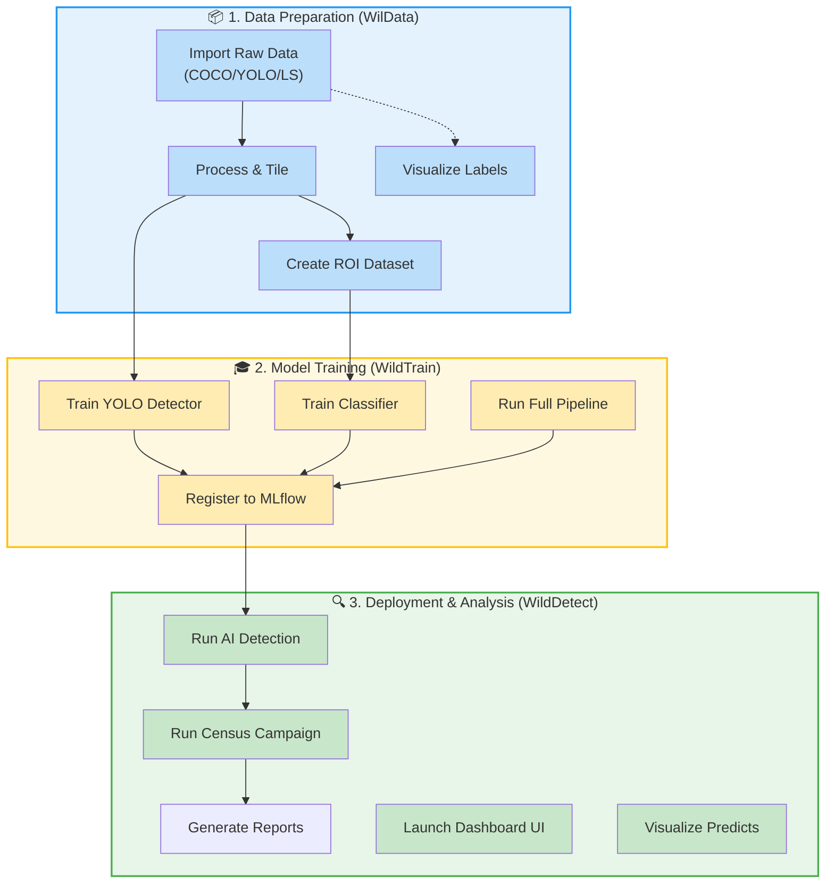

# 🗺️ Interactive Script Navigator

Use this interactive map to find the right script or CLI command for your task. **Click on any action** (the colored boxes) to jump directly to its documentation and configuration guide.

## How to use this Navigator
1. **Identify your current stage**: Are you preparing data, training models, or running analysis?
2. **Find your intent**: Each box represents a specific goal (e.g., "Import Raw Data").
3. **Click for details**: Clicking a box will take you to the exact section of the documentation describing the required `.bat` scripts and YAML configurations.

---

### Quick Access Summary

| Stage | Common Tasks | Entry Point |
| :--- | :--- | :--- |
| **Preparation** | Import, Tiling, ROI Extraction | [WilData Reference](scripts/wildata/) |
| **Training** | YOLO, Classification, Registration | [WildTrain Reference](scripts/wildtrain/) |
| **Inference** | Detection, Census, GIS Reports | [WildDetect Reference](scripts/wildetect/) |
| **Monitoring** | UI, Dashboard, MLflow | [Troubleshooting](troubleshooting.md) |
