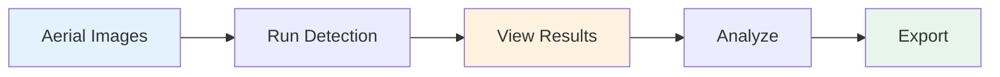

# End-to-End Detection Tutorial

This tutorial walks you through a complete wildlife detection workflow, from images to analysis results.

## Prerequisites

- WildDetect installed ([Installation Guide](../getting-started/installation.md))
- Aerial images with wildlife
- Trained model or access to MLflow registry
- MLflow server running (optional but recommended)

## Workflow Overview



## Step 1: Prepare Your Environment

### 1.1 Setup Directory Structure

```bash
mkdir D:\wildlife_detection
cd D:\wildlife_detection

# Create directories
mkdir images
mkdir results
mkdir models
```

### 1.2 Organize Your Images

```
D:\wildlife_detection\
├── images\
│   ├── drone_001.jpg
│   ├── drone_002.jpg
│   └── ...
├── results\
└── models\
```

### 1.3 Start MLflow (Optional)

```bash
cd wildetect
scripts\launch_mlflow.bat
```

Access at: `http://localhost:5000`

## Step 2: Configure Detection

### 2.1 Create Configuration File

Create `config/my_detection.yaml`:

```yaml
model:
  mlflow_model_name: "detector"
  mlflow_model_alias: "production"
  device: "cuda"

image_dir: "D:/wildlife_detection/images/"

processing:
  batch_size: 32
  tile_size: 800
  overlap_ratio: 0.2
  pipeline_type: "simple"  # or "raster" for large images
  confidence_threshold: 0.5

flight_specs:
  flight_height: 120.0
  gsd: 2.38  # Ground Sample Distance (cm/pixel)

output:
  directory: "D:/wildlife_detection/results"
  dataset_name: "my_detections"  # FiftyOne dataset name
  save_visualizations: true
```

### 2.2 Alternative: Use Model File

If not using MLflow:

```yaml
model:
  model_path: "D:/wildlife_detection/models/detector.pt"
  device: "cuda"
```

## Step 3: Run Detection

### Option A: Using Script

```bash
cd wildetect

# Edit config/detection.yaml
notepad config\detection.yaml

# Run
scripts\run_detection.bat
```

### Option B: Using CLI

```bash
wildetect detect D:/wildlife_detection/images/ \
    --model detector.pt \
    --output D:/wildlife_detection/results/ \
    --device cuda \
    --batch-size 32
```

### Option C: Using Python

```python
from wildetect.core.pipeline import DetectionPipeline
from pathlib import Path

# Initialize pipeline
pipeline = DetectionPipeline(
    model_path="detector.pt",
    device="cuda"
)

# Run detection
image_dir = Path("D:/wildlife_detection/images")
results = pipeline.detect_batch(image_dir)

# Save results
pipeline.save_results(results, "D:/wildlife_detection/results/detections.json")
```

### Expected Output

```
Processing images: 100%|██████████| 50/50 [00:45<00:00,  1.11it/s]
Detection complete!
Results saved to: D:/wildlife_detection/results/detections.json
Total detections: 1,234
```

## Step 4: Review Results

### 4.1 Results Structure

```
results/
├── detections.json          # All detections
├── detections.csv          # CSV format
├── summary.txt             # Summary statistics
├── visualizations/         # Annotated images
│   ├── drone_001.jpg
│   └── ...
└── fiftyone/              # FiftyOne dataset (if enabled)
```

### 4.2 Detection JSON Format

```json
{
  "image_path": "D:/wildlife_detection/images/drone_001.jpg",
  "image_size": [1920, 1080],
  "processing_time": 0.5,
  "detections": [
    {
      "class_name": "elephant",
      "confidence": 0.95,
      "bbox": [100, 200, 150, 180],
      "bbox_normalized": [0.052, 0.185, 0.078, 0.167]
    }
  ]
}
```

## Step 5: Visualize Results

### Option A: Using FiftyOne

```bash
# Launch FiftyOne
cd wildetect
scripts\launch_fiftyone.bat

# Or with CLI
wildetect fiftyone --action launch --dataset my_detections
```

Features:
- Interactive viewing
- Filtering by confidence
- Filtering by species
- Export capabilities

### Option B: View Saved Visualizations

```bash
# Open visualizations folder
explorer D:\wildlife_detection\results\visualizations
```

### Option C: Using Web UI

```bash
cd wildetect
scripts\launch_ui.bat
```

Navigate to results viewer.

## Step 6: Analyze Results

### 6.1 Basic Statistics

```bash
wildetect analyze D:/wildlife_detection/results/detections.json \
    --output D:/wildlife_detection/results/analysis/
```

### 6.2 Python Analysis

```python
import json
import pandas as pd
from collections import Counter

# Load results
with open("results/detections.json") as f:
    results = json.load(f)

# Count by species
species_counts = Counter()
for result in results:
    for det in result["detections"]:
        species_counts[det["class_name"]] += 1

print("Species Counts:")
for species, count in species_counts.items():
    print(f"  {species}: {count}")

# Calculate average confidence
confidences = []
for result in results:
    for det in result["detections"]:
        confidences.append(det["confidence"])

print(f"\nAverage Confidence: {sum(confidences)/len(confidences):.2f}")
```

### 6.3 Generate Report

```python
from wildetect.analysis import ReportGenerator

generator = ReportGenerator(results_path="results/detections.json")
report = generator.generate_report(
    output_path="results/report.pdf",
    include_maps=True,
    include_statistics=True
)
```

## Step 7: Filter and Refine

### 7.1 Filter by Confidence

```python
# Filter detections by confidence threshold
filtered_results = []
confidence_threshold = 0.7

for result in results:
    filtered_dets = [
        det for det in result["detections"]
        if det["confidence"] >= confidence_threshold
    ]
    if filtered_dets:
        filtered_results.append({
            **result,
            "detections": filtered_dets
        })

# Save filtered results
with open("results/filtered_detections.json", "w") as f:
    json.dump(filtered_results, f, indent=2)
```

### 7.2 Filter by Species

```python
# Keep only specific species
target_species = ["elephant", "giraffe"]

species_results = []
for result in results:
    species_dets = [
        det for det in result["detections"]
        if det["class_name"] in target_species
    ]
    if species_dets:
        species_results.append({
            **result,
            "detections": species_dets
        })
```

## Step 8: Export Results

### 8.1 Export to CSV

```python
import csv

# Convert to CSV
csv_data = []
for result in results:
    for det in result["detections"]:
        csv_data.append({
            "image": result["image_path"],
            "species": det["class_name"],
            "confidence": det["confidence"],
            "x": det["bbox"][0],
            "y": det["bbox"][1],
            "width": det["bbox"][2],
            "height": det["bbox"][3]
        })

# Save CSV
with open("results/detections.csv", "w", newline="") as f:
    writer = csv.DictWriter(f, fieldnames=csv_data[0].keys())
    writer.writeheader()
    writer.writerows(csv_data)
```

### 8.2 Export to Excel

```python
import pandas as pd

df = pd.DataFrame(csv_data)

# Create Excel with multiple sheets
with pd.ExcelWriter("results/detections.xlsx") as writer:
    df.to_excel(writer, sheet_name="All Detections", index=False)
    
    # Summary by species
    summary = df.groupby("species").agg({
        "confidence": ["count", "mean"]
    })
    summary.to_excel(writer, sheet_name="Summary")
```

### 8.3 Export to COCO Format

```python
from wildetect.export import COCOExporter

exporter = COCOExporter(results)
exporter.export("results/detections_coco.json")
```

## Step 9: Advanced Processing

### 9.1 Large Raster Detection

For large GeoTIFF files:

```yaml
# config/raster_detection.yaml
model:
  mlflow_model_name: "detector"
  device: "cuda"

image_paths:
  - "D:/orthomosaics/large_ortho.tif"

processing:
  tile_size: 800
  overlap_ratio: 0.2
  pipeline_type: "raster"
  nms_threshold: 0.5

flight_specs:
  gsd: 2.38  # Required for raster detection

output:
  directory: "results/raster"
```

```bash
wildetect detect --config config/raster_detection.yaml
```

### 9.2 Batch Processing Multiple Folders

```python
from pathlib import Path

# Process multiple folders
folders = [
    "D:/surveys/site_a/",
    "D:/surveys/site_b/",
    "D:/surveys/site_c/"
]

for folder in folders:
    folder_name = Path(folder).name
    results = pipeline.detect_batch(folder)
    pipeline.save_results(results, f"results/{folder_name}_detections.json")
```

## Troubleshooting

### Detection is Slow

**Solutions**:
1. Increase batch size (if GPU memory allows)
2. Use smaller tile size
3. Enable GPU acceleration
4. Use multithreaded pipeline

### Out of Memory

**Solutions**:
1. Reduce batch size
2. Reduce tile size
3. Use CPU instead of GPU
4. Close other applications

### Low Detection Accuracy

**Solutions**:
1. Check model is appropriate for your data
2. Adjust confidence threshold
3. Verify image quality
4. Check GSD matches training data

### Model Won't Load

**Solutions**:
1. Verify MLflow server is running
2. Check model name and alias
3. Verify model path if using file
4. Check CUDA availability

## Next Steps

- [Census Campaign Tutorial](census-campaign.md) - Run a full census
- [Dataset Preparation](dataset-preparation.md) - Prepare your own training data
- [Model Training](model-training.md) - Train custom models
- [Geographic Visualization](../scripts/wildetect/index.md#extract-gps) - Create maps

## Complete Example Script

```python
#!/usr/bin/env python3
"""
Complete detection workflow example
"""
from pathlib import Path
from wildetect.core.pipeline import DetectionPipeline
import json

def main():
    # Configuration
    image_dir = Path("D:/wildlife_detection/images")
    output_dir = Path("D:/wildlife_detection/results")
    model_path = "detector.pt"
    
    # Initialize pipeline
    print("Initializing detection pipeline...")
    pipeline = DetectionPipeline(
        model_path=model_path,
        device="cuda"
    )
    
    # Run detection
    print(f"Processing images in {image_dir}...")
    results = pipeline.detect_batch(image_dir)
    
    # Save results
    output_dir.mkdir(exist_ok=True)
    results_file = output_dir / "detections.json"
    pipeline.save_results(results, results_file)
    print(f"Results saved to {results_file}")
    
    # Print summary
    total_detections = sum(len(r["detections"]) for r in results)
    print(f"\nSummary:")
    print(f"  Images processed: {len(results)}")
    print(f"  Total detections: {total_detections}")
    
    # Species breakdown
    from collections import Counter
    species = Counter()
    for result in results:
        for det in result["detections"]:
            species[det["class_name"]] += 1
    
    print(f"\nSpecies breakdown:")
    for name, count in species.items():
        print(f"  {name}: {count}")

if __name__ == "__main__":
    main()
```

Save as `run_detection.py` and run:

```bash
python run_detection.py
```

---

**Congratulations!** You've completed the end-to-end detection tutorial. You now know how to run detection, visualize results, and export data for further analysis.

