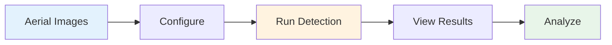

# End-to-End Detection Tutorial

This tutorial walks you through a complete wildlife detection workflow, from images to analysis results — all using the CLI.

## Prerequisites

- WildDetect installed ([Installation Guide](../getting-started/installation.md))
- Aerial images with wildlife
- Trained model or access to MLflow registry
- MLflow server running (optional but recommended)

## Workflow Overview


```mermaid
graph LR
    A[Aerial Images] --> B[Configure]
    B --> C[Run Detection]
    C --> D[View Results]
    D --> E[Analyze]
    
    style A fill:#e3f2fd
    style C fill:#fff3e0
    style E fill:#e8f5e9
```

## Step 1: Prepare Your Environment

### 1.1 Setup Directory Structure

```bash
mkdir D:\wildlife_detection
cd D:\wildlife_detection

# Create directories
mkdir images
mkdir results
mkdir config
```

### 1.2 Organize Your Images

```
D:\wildlife_detection\
├── images\
│   ├── drone_001.jpg
│   ├── drone_002.jpg
│   └── ...
├── results\
└── config\
    └── detection.yaml
```

### 1.3 Start MLflow (Optional)

```bash
cd wildetect
scripts\launch_mlflow.bat
```

Access at: `http://localhost:5000`

## Step 2: Configure Detection

### 2.1 Create Configuration File

Create `config/detection.yaml`:

```yaml
model:
  mlflow_model_name: "detector"
  mlflow_model_alias: "production"
  device: "cuda"

image_dir: "D:/wildlife_detection/images/"

processing:
  batch_size: 32
  tile_size: 800
  overlap_ratio: 0.2
  pipeline_type: "simple"  # or "raster" for large images
  confidence_threshold: 0.5

flight_specs:
  flight_height: 120.0
  gsd: 2.38  # Ground Sample Distance (cm/pixel)

output:
  directory: "D:/wildlife_detection/results"
  dataset_name: "my_detections"  # FiftyOne dataset name
  save_visualizations: true
```

### 2.2 Alternative: Use Model File

If not using MLflow:

```yaml
model:
  model_path: "D:/wildlife_detection/models/detector.pt"
  device: "cuda"
```

### 2.3 Generate a Default Config

You can generate a starter detection config file using:

```bash
wildetect utils create-config detect -o config/detection.yaml
```

## Step 3: Run Detection

### Option A: Using the CLI

```bash
wildetect detection detect -c config/detection.yaml
```

### Option B: Using the Provided Script

```bash
cd wildetect

# Edit config/detection.yaml first
notepad config\detection.yaml

# Run
scripts\run_detection.bat
```

### Expected Output

```
Processing images: 100%|██████████| 50/50 [00:45<00:00,  1.11it/s]
Detection complete!
Results saved to: D:/wildlife_detection/results/results.json
Total detections: 1,234
```

## Step 4: Review Results

### 4.1 Results Structure

```
results/
├── results.json             # All detections with coordinates
└── visualizations/          # Annotated images (if enabled)
    ├── drone_001.jpg
    └── ...
```

### 4.2 Detection JSON Format

```json
{
  "image_path": "D:/wildlife_detection/images/drone_001.jpg",
  "image_size": [1920, 1080],
  "processing_time": 0.5,
  "detections": [
    {
      "class_name": "elephant",
      "confidence": 0.95,
      "bbox": [100, 200, 150, 180],
      "bbox_normalized": [0.052, 0.185, 0.078, 0.167]
    }
  ]
}
```

## Step 5: Visualize Results

### Option A: Using FiftyOne

```bash
# Launch FiftyOne app
wildetect services fiftyone -a launch

# Get dataset info
wildetect services fiftyone -a info -d my_detections
```

Features:

- Interactive viewing
- Filtering by confidence
- Filtering by species
- Export capabilities

### Option B: View Saved Visualizations

```bash
# Open visualizations folder
explorer D:\wildlife_detection\results\visualizations
```

### Option C: Using Web UI

```bash
# Launch the Streamlit interface
wildetect services ui
```

Navigate to the results viewer section.

## Step 6: Analyze Results

Run analysis on the detection results:

```bash
wildetect detection analyze D:/wildlife_detection/results/results.json \
    -o D:/wildlife_detection/results/analysis/
```

## Step 7: Export to FiftyOne

Export detection results to a FiftyOne dataset for further exploration:

```bash
# Export to COCO format
wildetect services fiftyone -a export -d my_detections -f coco -o exports/coco/

# Export to YOLO format
wildetect services fiftyone -a export -d my_detections -f yolo -o exports/yolo/
```

## Step 8: Advanced — Large Raster Detection

For large GeoTIFF / orthomosaic files, use the `raster` pipeline:

```yaml
# config/raster_detection.yaml
model:
  mlflow_model_name: "detector"
  device: "cuda"

image_paths:
  - "D:/orthomosaics/large_ortho.tif"

processing:
  tile_size: 800
  overlap_ratio: 0.2
  pipeline_type: "raster"
  nms_threshold: 0.5

flight_specs:
  gsd: 2.38  # Required for raster detection

output:
  directory: "results/raster"
```

```bash
wildetect detection detect -c config/raster_detection.yaml
```

## Step 9: System Info

Check your environment and GPU status:

```bash
wildetect utils info
```

This shows Python version, PyTorch version, CUDA availability, GPU info, and installed dependencies.

## Troubleshooting

### Detection is Slow

**Solutions**:

1. Increase batch size (if GPU memory allows)
2. Use smaller tile size
3. Enable GPU acceleration (`device: "cuda"`)
4. Use the multi-threaded pipeline (`pipeline_type: "mt"`)

### Out of Memory

**Solutions**:

1. Reduce batch size
2. Reduce tile size
3. Use CPU instead of GPU (`device: "cpu"`)
4. Close other applications

### Low Detection Accuracy

**Solutions**:

1. Check model is appropriate for your data
2. Adjust confidence threshold
3. Verify image quality
4. Check GSD matches training data

### Model Won't Load

**Solutions**:

1. Verify MLflow server is running (`scripts\launch_mlflow.bat`)
2. Check model name and alias match MLflow registry
3. Verify model path if using a local file
4. Check CUDA availability with `wildetect utils info`

## Next Steps

- [Census Campaign Tutorial](census-campaign.md) — Run a full census
- [Dataset Preparation](dataset-preparation.md) — Prepare your own training data
- [Model Training](model-training.md) — Train custom models
- [WildDetect CLI Reference](../api-reference/wildetect-cli.md) — All CLI commands

---

**Congratulations!** You've completed the end-to-end detection tutorial using the WildDetect CLI. You now know how to configure, run detection, visualize results, and export data.
