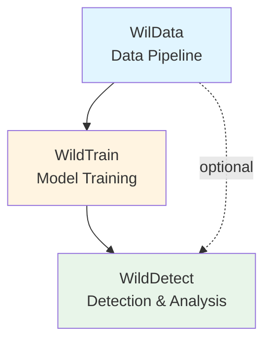
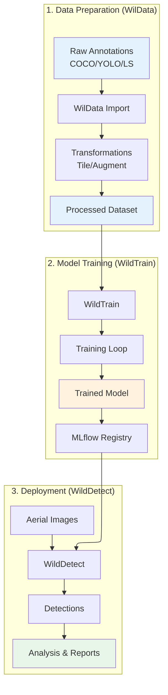

# Architecture Overview

The WildDetect monorepo is designed as a modular ecosystem of three interconnected packages, each serving a specific purpose in the wildlife detection and analysis pipeline.

## Monorepo Structure

```
wildetect/                 # Monorepo root
├── wildata/              # 📦 Data management package
├── wildtrain/            # 🎓 Model training package  
├── src/wildetect/        # 🔍 Detection and analysis package
├── config/               # Shared configurations
├── scripts/              # Batch scripts
├── docs/                 # Documentation
└── mkdocs.yml           # Documentation config
```

## Package Relationships

The three packages have a clear dependency hierarchy:



### Dependency Flow

1. **WilData** (Foundation)
   - Standalone package
   - No dependencies on other packages
   - Provides data management primitives

2. **WildTrain** (Training)
   - Depends on WilData for dataset loading
   - Can be used independently for model training
   - Outputs models for WildDetect

3. **WildDetect** (Application)
   - Depends on WildTrain for model structures
   - Optionally uses WilData for data handling
   - Top-level application package

## Core Principles

### 1. Separation of Concerns

Each package has a single, well-defined responsibility:

- **WilData**: "How do I manage and transform data?"
- **WildTrain**: "How do I train and evaluate models?"
- **WildDetect**: "How do I detect wildlife and analyze results?"

### 2. Modularity

The toolkit is designed with modularity in mind, allowing each package to be used independently via its CLI or service interface.

### 3. Configuration-Driven

All behavior is configurable via YAML files:

```yaml
# Each package has its own configs
wildetect/config/         # Detection configs
wildata/configs/          # Data configs
wildtrain/configs/        # Training configs
```

### 4. Clean Architecture

Each package follows clean architecture principles:

```
src/package/
├── core/          # Business logic (domain)
├── adapters/      # External interfaces
├── cli/           # Command-line interface
├── api/           # REST API (if applicable)
└── ui/            # User interface (if applicable)
```

## Package Overview

### 📦 WilData - Data Management

**Purpose**: Unified data pipeline for object detection datasets

**Key Features**:
- Multi-format import/export (COCO, YOLO, Label Studio)
- Data transformations (tiling, augmentation, clipping)
- ROI dataset creation
- DVC integration for versioning
- REST API for remote operations

**Use Cases**:
- Import annotations from labeling tools
- Prepare datasets for training
- Create ROI datasets for hard sample mining
- Version control large datasets

[Learn more →](wildata.md)

### 🎓 WildTrain - Model Training

**Purpose**: Modular training framework for detection and classification

**Key Features**:
- Multiple frameworks (YOLO, MMDetection, PyTorch Lightning)
- Hydra configuration management
- MLflow experiment tracking
- Hyperparameter optimization (Optuna)
- Model registration and versioning

**Use Cases**:
- Train custom detection models
- Train classification models
- Hyperparameter tuning
- Model evaluation and comparison
- Export models for deployment

[Learn more →](wildtrain.md)

### 🔍 WildDetect - Detection & Analysis

**Purpose**: Production detection system with census capabilities

**Key Features**:
- Multi-threaded detection pipelines
- Large raster image support
- Census campaign orchestration
- Geographic analysis and visualization
- FiftyOne integration
- Comprehensive reporting

**Use Cases**:
- Run detection on aerial imagery
- Conduct wildlife census campaigns
- Generate population statistics
- Create geographic visualizations
- Export results for analysis

[Learn more →](wildetect.md)

## Complete Workflow

> [!TIP]
> **New to WildDetect?** Use the [Interactive Script Navigator](../script-navigator.md) to visually explore which scripts and CLI commands correspond to each step in the workflow.



### Example: Complete Pipeline

A typical workflow involves preparing data with WilData, training a model with WildTrain, and then performing detection and analysis with WildDetect.

[See detailed data flow →](data-flow.md)

## Technology Stack

### Core Technologies

| Component | Technology | Purpose |
|-----------|-----------|---------|
| **Language** | Python 3.9+ | Primary language |
| **CLI** | Typer | Command-line interfaces |
| **Config** | Hydra/OmegaConf | Configuration management |
| **Detection** | YOLO, MMDetection | Object detection |
| **Training** | PyTorch Lightning | Model training |
| **API** | FastAPI | REST API (WilData) |
| **UI** | Streamlit | Web interfaces |
| **Visualization** | FiftyOne | Dataset visualization |
| **Tracking** | MLflow | Experiment tracking |
| **Versioning** | DVC | Data versioning |

### Key Libraries

#### Data Processing
- **Pillow**: Image processing
- **OpenCV**: Computer vision operations
- **Rasterio**: Geospatial raster data
- **Pandas**: Tabular data manipulation
- **Albumentations**: Data augmentation

#### Machine Learning
- **PyTorch**: Deep learning framework
- **Ultralytics**: YOLO implementation
- **MMDetection**: Detection framework
- **Torchvision**: Vision utilities

#### Utilities
- **Pydantic**: Data validation
- **Rich**: Terminal formatting
- **TQDM**: Progress bars
- **PyYAML**: YAML parsing

## Design Patterns

The project uses various design patterns to ensure modularity and extensibility, such as the Factory pattern for creating components and the Strategy pattern for implementing different detection algorithms.

## Configuration Management

### Hierarchical Configuration

Each package uses a hierarchical configuration system:

```yaml
# configs/main.yaml
defaults:
  - model: yolo
  - data: coco
  - training: default

# Override with CLI
python main.py model=custom data.batch_size=64
```

### Configuration Sources

1. **Default configs**: Sensible defaults in code
2. **YAML files**: User configurations
3. **Environment variables**: `.env` files
4. **CLI arguments**: Command-line overrides

Priority: CLI > Env Vars > YAML > Defaults

## Error Handling

### Centralized Error Management
The ecosystem includes a centralized error handling system to provide clear feedback on common issues like configuration errors or image loading problems.

### Validation
All inputs and configurations are validated to ensure they meet the required schema, preventing runtime errors.

## Logging and Monitoring

### Structured Logging
Comprehensive logging is implemented across all packages to track core operations and simplify debugging.

### Experiment Tracking
Built-in support for MLflow allows for detailed tracking of model training runs, metrics, and hyperparameter tuning.

## Testing Strategy

WildDetect uses a robust testing strategy including unit, integration, and end-to-end tests to ensure reliability across all packages.

## Performance Considerations

### Optimization Strategies

1. **Multi-threading**: For I/O-bound operations (Windows-compatible)
2. **Batch Processing**: Process multiple images together
3. **Caching**: Cache loaded models and configurations
4. **Memory Management**: Efficient image loading and cleanup
5. **GPU Utilization**: Maximize GPU usage with appropriate batch sizes

### Scalability

- **Horizontal**: Process multiple images in parallel
- **Vertical**: Use larger models and batch sizes
- **Distributed**: Deploy inference servers for remote processing

## Security Considerations

- **API Keys**: Stored in `.env`, never in code
- **File Paths**: Validated before processing
- **Input Validation**: All inputs validated with Pydantic
- **Dependency Management**: Regular security updates

## Next Steps

Explore individual package architectures:

- [WilData Architecture →](wildata.md)
- [WildTrain Architecture →](wildtrain.md)
- [WildDetect Architecture →](wildetect.md)
- [Data Flow Details →](data-flow.md)

Or dive into specific topics:

- [Scripts Reference →](../scripts/wildetect/index.md)
- [Configuration Reference →](../configs/wildetect/index.md)
- [CLI Reference →](../api-reference/wildetect-cli.md)
