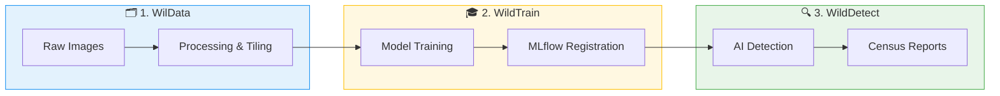

# Automated Wildlife detection

  
   
  <h3>Transforming Aerial Imagery into Actionable Conservation Intelligence</h3>

---

## The Mission

WildDetect is more than just a detection tool; it's a comprehensive **AI-driven ecosystem** designed to solve one of the most critical challenges in modern conservation: **scalable and accurate wildlife monitoring.**

By automating the transition from raw aerial imagery to detailed census reports, WildDetect empowers researchers and conservationists to focus on protection and policy, rather than manual image scanning.

---

## 🏗️ An Integrated Ecosystem

WildDetect is built on a modular three-tier architecture that mirrors the natural workflow of a data-driven conservation project:

### 1. The Foundation: **WilData**
Ensure your data is high-quality, version-controlled, and ready for intelligence. WilData handles the complex "plumbing" of multi-format imports (COCO, YOLO, Label Studio), geospatial metadata extraction, and large-scale image tiling.

### 2. The Intelligence: **WildTrain**
Transform raw observations into specialized AI models. WildTrain provides a flexible framework for training state-of-the-art YOLO detectors and deep-learning classifiers, integrated with MLflow for complete experiment traceability.

### 3. The Impact: **WildDetect**
Deploy your models in the field. WildDetect orchestrates the final "census campaigns," processing thousands of images to generate statistically sound population counts, density maps, and professional PDF reports.

---

## 🗺️ How it Works: The End-to-End Workflow

WildDetect provides a seamless pipeline from raw data to field impact. 

> [!TIP]
> **New to the project?** Use the [Interactive Script Navigator](script-navigator.md) to visually explore which scripts and CLI commands correspond to each step in the workflow below.

---

## 🧭 Your Journey Starts Here

Choose the path that best fits your current goal:

### 🏁 Getting Started
- **[Installation Guide](getting-started/installation.md)** - Set up your environment (UV, CUDA, and Dependencies).
- **[Quick Start](getting-started/quick-start.md)** - Run your first detection in under 5 minutes.
- **[Interactive Script Navigator](script-navigator.md)** - A visual map of all available tools.

### 🧪 Training & Research
- **[Dataset Preparation](tutorials/dataset-preparation.md)** - Master the WilData pipeline.
- **[Model Training Guide](tutorials/model-training.md)** - Train custom YOLO and classification models.
- **[Configuration Reference](configs/wildetect/index.md)** - Deep dive into YAML configurations.

### 📡 Field Operations
- **[End-to-End Detection](tutorials/end-to-end-detection.md)** - Run a complete production detection job.
- **[Census Campaign Guide](tutorials/census-campaign.md)** - Orchestrate large-scale aerial surveys.
- **[Geographic Analysis](architecture/data-flow.md#geographic-analysis)** - Analyze population density and GPS coverage.

---

## 🤝 Community & Support

- **Contribute**: As an open-source project, we welcome contributions! From bug reports to code improvements, check out our [GitHub Issues](https://github.com/fadelmamar/wildetect/issues) to see what we're working on.
- **Feedback**: Share your conservation use cases or model results on the [GitHub Discussions](https://github.com/fadelmamar/wildetect/discussions).

---

  <i>Developed with ❤️ for the conservation community by Seydou Fadel M. and Allin Paul.</i>

