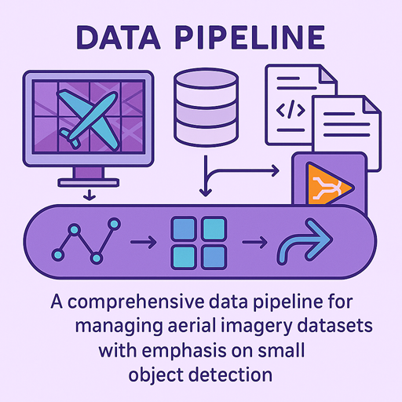

<div align="center">
  
</div>

# WildTrain Data Pipeline

A comprehensive data pipeline for managing object detection datasets with support for COCO and YOLO formats, data transformations (tiling, offline data augmentation etc.), and DVC integration for data versioning.

## Features

### 🎯 Core Features
- **Multi-format Support**: Import from COCO and YOLO formats
- **Master Format**: Unified internal representation for all datasets
- **Data Validation**: Comprehensive validation for each format
- **Framework Export**: Export to COCO and YOLO formats for training
- **Data Transformations**: Augmentation and tiling capabilities

### 📦 DVC Integration
- **Data Versioning**: Git-like versioning for datasets
- **Remote Storage**: Support for S3, GCS, Azure, SSH, and HDFS
- **Pipeline Management**: Automated workflows with `dvc.yaml`
- **Experiment Tracking**: Track dataset versions and transformations
- **Collaboration**: Share datasets across teams

### 🔧 Data Transformations
- **Augmentation**: Rotation, brightness, contrast, noise
- **Tiling**: Image tiling with configurable parameters
- **Pipeline Support**: Chain multiple transformations

## Installation

### Basic Installation
```bash
uv venv --python 3.10
# If CUDA 
uv pip install torch==2.6.0 torchvision torchaudio --index-url https://download.pytorch.org/whl/cu118
uv pip install -e .
# else
uv sync
```

### With DVC Support
```bash
# Install with DVC support
uv pip install "wildata[dvc]"

# For cloud storage support
uv pip install "wildata[dvc]" "dvc[s3]"    # AWS S3
uv pip install "wildata[dvc]" "dvc[gcs]"   # Google Cloud Storage
uv pip install "wildata[dvc]" "dvc[azure]" # Azure Blob Storage
```

## Quick Start

### 1. Basic Usage

```bash
# Import a COCO dataset
wildata dataset import /path/to/annotations.json coco my_dataset

# Import a YOLO dataset
wildata dataset import /path/to/data.yaml yolo my_dataset

# List all datasets
wildata dataset list

# Export to framework format
wildata dataset export my_dataset coco
```

### 2. With Data Transformations

```bash
# Import with augmentation
wildata dataset import /path/to/data coco my_dataset --augment

# Import with tiling
wildata dataset import /path/to/data yolo my_dataset --tile

# Import with both transformations
wildata dataset import /path/to/data coco my_dataset --augment --tile
```

### 3. With DVC Integration

```bash
# Setup DVC remote storage
wildata dvc setup --storage-type local --storage-path ./dvc_storage

# Import with DVC tracking
wildata dataset import /path/to/data coco my_dataset --track-with-dvc

# Check DVC status
wildata dvc status

# Pull data from remote
wildata dvc pull

# Push data to remote
wildata dvc push
```

### 4. Using the Web UI

WildData also provides a user-friendly Streamlit web interface:

```bash

# Run the UI
streamlit run src/wildata/ui.py

# Or use the provided scripts
python scripts/run-ui.py  # Cross-platform
scripts/run-ui.bat        # Windows
```

The UI will be available at http://localhost:8501 and provides:
- 📥 Import & Export operations
- 🎯 ROI dataset creation
- 📍 GPS data updates
- 👁️ Dataset visualization
- 📊 Dataset management

For detailed UI documentation, see [docs/ui_usage.md](docs/ui_usage.md).

## CLI Commands

### Dataset Management
```bash
# Import dataset
wildata dataset import <source_path> <format> <dataset_name> [options]

# List datasets
wildata dataset list

# Get dataset info
wildata dataset info <dataset_name>

# Export dataset
wildata dataset export <dataset_name> <format>

# Delete dataset
wildata dataset delete <dataset_name>
```

### DVC Operations
```bash
# Setup DVC
wildata dvc setup [options]

# Check status
wildata dvc status

# Pull data
wildata dvc pull [dataset_name]

# Push data
wildata dvc push

# Create pipeline
wildata dvc pipeline <pipeline_name> [options]

# Run pipeline
wildata dvc run <pipeline_name>
```

### Data Validation
```bash
# Validate dataset
wildata validate <source_path> <format>
```

## Python API

### Basic Usage
```python
from wildata.pipeline.data_pipeline import DataPipeline

# Initialize pipeline
pipeline = DataPipeline("data")

# Import dataset
result = pipeline.import_dataset(
    source_path="/path/to/data",
    source_format="coco",
    dataset_name="my_dataset"
)

# List datasets
datasets = pipeline.list_datasets()
```

### With DVC Integration
```python
from wildata.pipeline.data_pipeline import DataPipeline
from wildata.pipeline.dvc_manager import DVCConfig, DVCStorageType

# Configure DVC
config = DVCConfig(
    storage_type=DVCStorageType.S3,
    storage_path="s3://my-bucket/datasets"
)

# Initialize pipeline with DVC
pipeline = DataPipeline("data", enable_dvc=True, dvc_config=config)

# Import with DVC tracking
result = pipeline.import_dataset(
    source_path="/path/to/data",
    source_format="coco",
    dataset_name="my_dataset",
    track_with_dvc=True
)
```

## Configuration

### DVC Storage Types

#### Local Storage
```bash
wildata dvc setup --storage-type local --storage-path ./dvc_storage
```

#### AWS S3
```bash
wildata dvc setup --storage-type s3 --storage-path s3://my-bucket/datasets
export AWS_ACCESS_KEY_ID=your_access_key
export AWS_SECRET_ACCESS_KEY=your_secret_key
```

#### Google Cloud Storage
```bash
wildata dvc setup --storage-type gcs --storage-path gs://my-bucket/datasets
export GOOGLE_APPLICATION_CREDENTIALS=/path/to/service-account.json
```

#### Azure Blob Storage
```bash
wildata dvc setup --storage-type azure --storage-path azure://my-container/datasets
export AZURE_STORAGE_CONNECTION_STRING=your_connection_string
```

## Data Transformations

### Augmentation
```bash
# Basic augmentation
wildata dataset import data coco dataset --augment

# Custom augmentation parameters
wildata dataset import data coco dataset --augment \
  --rotation -15 15 \
  --probability 0.7 \
  --brightness 0.8 1.2 \
  --contrast 0.9 1.1 \
  --noise 0.02
```

### Tiling
```bash
# Basic tiling
wildata dataset import data coco dataset --tile

# Custom tiling parameters
wildata dataset import data coco dataset --tile \
  --tile-size 512 \
  --stride 256 \
  --min-visibility 0.1 \
  --max-negative-tiles 3
```

## Advanced Filtering

WildTrain supports advanced dataset filtering and mining, configurable via YAML or CLI. The filtering pipeline is modular and includes:

- **Feature Extraction**: Extract features from images using configurable models (e.g., DINOv2).
- **Quality Filtering**: Remove low-quality or outlier samples based on size, aspect ratio, etc.
- **Clustering**: Cluster samples and subsample for diversity.
- **Hard Sample Mining**: Identify and select hard/ambiguous samples for focused annotation or training.

### Filter Configuration Example (YAML)

```yaml
filter_config:
  feature_extractor:
    model_name: "facebook/dinov2-with-registers-small"
    device: "auto"
  quality:
    size_filter_enabled: true
    min_size: 10
    max_size_ratio: 0.8
    aspect_ratio_filter_enabled: true
    min_ratio: 0.1
    max_ratio: 10.0
  clustering:
    enabled: false
    n_clusters: 50
    samples_per_cluster: 5
    method: "kmeans"
    x_percent: 0.3
  hard_sample_mining:
    enabled: false
    miner_type: "confidence"
    gt_annotations: null
    nms_thresholds: null
    margin_band: 0.1
    roi_box_size: 128
    min_roi_size: 32
    batch_size: 32
    top_k: null
    threshold: null
```

- You can specify this in your import config YAML or override via CLI.
- All filter groups are fully type-checked and validated using Pydantic models.
- See `src/wildtrain/filters/filter_config.py` for all available options.

### Using Filtering in the CLI

```bash
wildata dataset import --config my_import_config.yaml
# or override filter options directly
wildata dataset import ... --filter-config '{"quality": {"min_size": 20}}'
```

## ROI Extraction and Conversion

WildTrain provides an ROI Adapter for converting object detection datasets (COCO) into ROI (Region of Interest) classification datasets. This is useful for tasks like hard sample mining, error analysis, or training ROI-based classifiers.

### Features
- Extracts ROIs from bounding boxes in COCO annotations.
- Supports custom ROI extraction logic via callback.
- Generates random/background ROIs for unannotated images.
- Saves ROI crops, labels, class mappings, and statistics.
- Highly configurable (ROI size, padding, background class, etc.).

### Example Usage (Python)
```python
from wildtrain.adapters.roi_adapter import ROIAdapter

# Load COCO data (dict)
coco_data = ...
roi_adapter = ROIAdapter(coco_data, roi_box_size=128, min_roi_size=32)
roi_data = roi_adapter.convert()
roi_adapter.save(roi_data, output_labels_dir="labels/", output_images_dir="images/")
```

- See `src/wildata/adapters/roi_adapter.py` for all options and details.
- Useful for mining hard samples, creating ROI classification datasets, or augmenting training data.

## Project Structure

```
project/
├── data/                    # Master data storage
│   ├── images/             # Image files
│   └── annotations/        # Master annotations
├── .dvc/                   # DVC configuration
├── dvc.yaml               # Pipeline definitions
└── .gitignore             # Git ignore rules
```

## Examples

### Complete Workflow Example
```bash
# 1. Setup DVC
wildata dvc setup --storage-type local

# 2. Import dataset with transformations
wildata dataset import /path/to/raw_data coco my_dataset \
  --augment \
  --tile \
  --track-with-dvc

# 3. Export for training
wildata dataset export my_dataset yolo

# 4. Check status
wildata dvc status
wildata dataset list
```

### Pipeline Example
```yaml
# dvc.yaml
stages:
  import:
    cmd: wildata dataset import data/raw coco raw_dataset --track-with-dvc
    deps:
      - data/raw
    outs:
      - data/processed

  augment:
    cmd: wildata dataset transform raw_dataset --augment --output-name augmented_dataset
    deps:
      - data/processed
    outs:
      - data/augmented

  export:
    cmd: wildata dataset export augmented_dataset yolo
    deps:
      - data/augmented
    outs:
      - data/exports
```

## Testing

```bash
# Run all tests
uv run python -m pytest -v

# Run specific test file
uv run python -m pytest tests/test_dvc_integration.py -v

# Run with coverage
uv run python -m pytest --cov=wildtrain tests/
```

## Documentation

- [DVC Integration Guide](docs/DVC_INTEGRATION.md)
- [Transformation Documentation](docs/TRANSFORMATIONS.md)
- [API Reference](docs/API.md)

## Contributing

1. Fork the repository
2. Create a feature branch
3. Make your changes
4. Add tests for new functionality
5. Submit a pull request

## License

This project is licensed under the MIT License - see the [LICENSE](LICENSE) file for details.

## Acknowledgments

- [DVC](https://dvc.org/) for data versioning capabilities
- [COCO](https://cocodataset.org/) for the annotation format
- [YOLO](https://github.com/ultralytics/yolov5) for the annotation format
- [Albumentations](https://albumentations.ai/) for data augmentation
